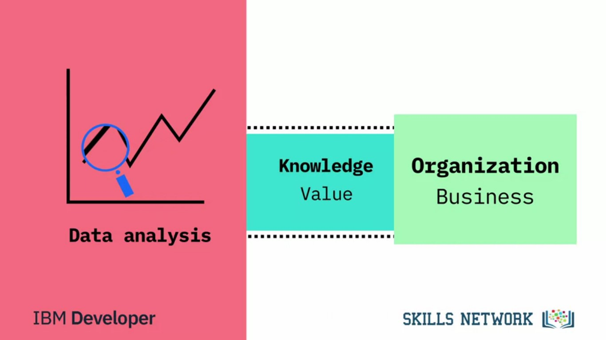
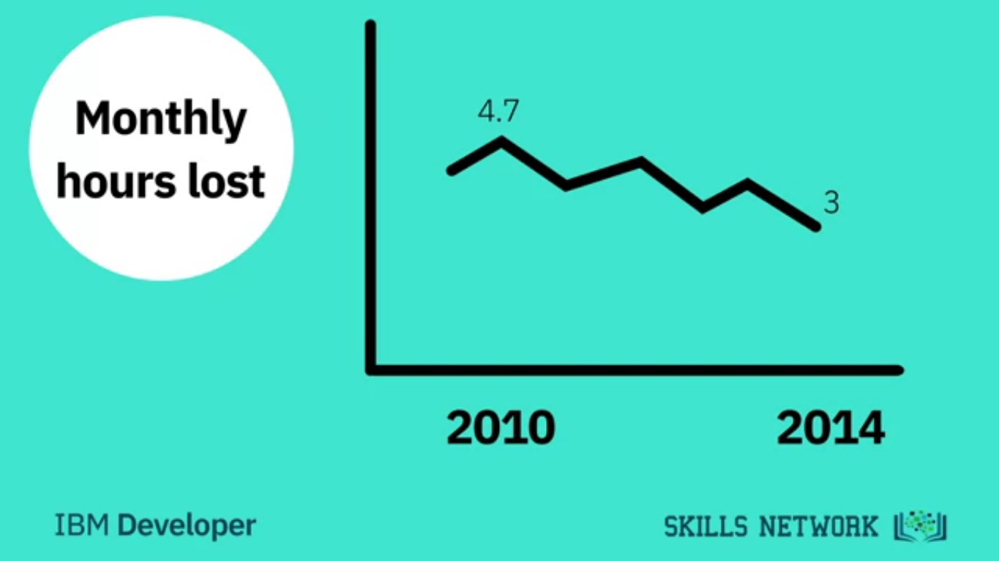

# Week 1: Defining Data Science and What Data Scientists Do
https://www.coursera.org/learn/what-is-datascience/home/week/1

In this module, you will view the course syllabus to learn what will be taught in this course. You will hear from data science professionals to discover what data science is, what data scientists do, and what tools and algorithms data scientists use on a daily basis. Finally, you will complete a reading assignment to find out why data science is considered the sexiest job in the 21st century.

### Learning Objectives
1. Define data science and its importance in today’s data driven world.
2. Describe the various paths that can lead to a career in data science.
3. Describe the advice given by seasoned data science professionals to data scientists who are just starting out.
4. Explain why data science is considered the sexiest job in the 21st century.
5. Describe what a typical day in the life of a data scientist looks like.
6. Describe some of the commonly used terms in data science including regression.
7. Describe the impact of cloud technologies on data science.
8. Describe some of the key qualities of a successful data scientist.

# 1.1. What is Data Science?
https://www.coursera.org/learn/what-is-datascience/lecture/kIuf0/what-is-data-science

#### Shingai Manjengwa, CEO, Fireside Analytics Inc.
> Data Science is a process, not an event. It is the process of using data to understand different things, to understand the world. 

#### Rafael B. Da Silva
>For me is when you have a model or hypothesis of a problem, and you try to validate that hypothesis or model with your data.

#### Diana Zarate Diaz
> Data science is the art of uncovering the insights and trends that are hiding behind data.

#### Luis O. Martins
> It's when you translate data into a story. So use storytelling to generate insight. And with these insights, you can make strategic choices for a company or an institution.

#### Mandeep Kaur
> Data science is a field about processes and systems to extract data from various forms of whether it is unstructured or structured form.

#### Stephen Sherman
> Data science is the study of data. Like biological sciences is a study of biology, physical sciences, it's the study of physical reactions. Data is real, data has real properties, and we need to study them if we're going to work on them.

#### Murtaza Haider, PhD, Associate Professor, Ted Rogers School of Management
> Data Science involves data and some science. The definition or the name came up in the 80s and 90s when some professors were looking into the statistics curriculum, and they thought it would be better to call it data science. But what is Data Science? I'd see data science as one's attempt to work with data, to find answers to questions that they are exploring. In a nutshell, it's more about data than it is about science. If you have data, and you have curiosity, and you're working with data, and you're manipulating it, you're exploring it, the very exercise of going through analyzing data, trying to get some answers from it is data science. Data science is relevant today because we have tons of data available. We used to worry about lack of data. Now we have a data deluge. In the past, we didn't have algorithms, now we have algorithms. In the past, the software was expensive, now it's open source and free. In the past, we couldn't store large amounts of data, now for a fraction of the cost, we can have gazillions of datasets for a very low cost. So, the tools to work with data, the very availability of data, and the ability to store and analyze data, it's all cheap, it's all available, it's all ubiquitous, it's here. There's never been a better time to be a data scientist.

Data science is the field of exploring, manipulating, and analyzing data, and using data to answer questions or make recommendations.

Although the different data scientists interviewed in the video gave what seemed like different answers, they all agreed that data science involved using data to answer questions or make recommendations.

# 1.2. Fundamentals of Data Science
https://www.coursera.org/learn/what-is-datascience/lecture/tPgFU/fundamentals-of-data-science

Data Science has a significant **data analysis** component.

Data analysis isn't new.

What is new is the vast quantity of data available from massively varied sources:
1. Log files
2. E-mail
3. Social media
4. Sales data
5. Patient information files
6. Sports performance data
7. Sensor data
8. Security cameras

At the same time that there is more data available than ever, we have the computing power needed to make a useful analysis and reveal new knowledge.

Data science can help organizations:
1. Understand their environments
2. Analyze existing issues
3. Reveal previously hidden opportunities

Data scientists use data analysis to add to the **knowledge** of the organization by investigating data, exploring the best way to use it to provide **value** to the business.

### The process of data science:
First step: defines how the **data science project** progresses.
1. Focus on a specific problem
2. Clarify the question that the organization wants answered.

Good data scientists are curious people who **ask questions** to clarify the business need.
#### What data do we need to solve the problem, and where will that data come from?
1. Structured
2. Unstructured data

Using multiple models to explore the data reveals:
1. Patterns
2. Archetypes
3. Outliers

Sometimes, this will confirm what the organization **suspects**, but sometimes it will be completely **new knowledge**, leading the organization to a **new approach**.

When the data has revealed its **insights**, the role of the data scientist becomes that of a **storyteller**, **communicating** the results to the project stakeholders.

#### Data visualization tools
Help stakeholders understand:
1. The nature of the results
2. Recommended action to take

#### Data Science is changing:
1. The way we work
2. The way we use data
3. Our approach to the world
4. The way organisations understand the world.

# 1.3. The Many Paths to Data Science
https://www.coursera.org/learn/what-is-datascience/lecture/QcFwx/the-many-paths-to-data-science

#### Shingai Manjengwa, CEO, Fireside Analytics Inc.
> Data science didn't really exist when I was growing up. It's not something that I ever woke up and said, I want to be a data scientist when I grow up. No, it didn't exist. I didn't know I would be working in data science.

> My undergraduate degree was in business, and I majored in politics, philosophy, and economics and then I did a masters in business analytics at New York University at
the Stern School of Business. When I left my undergrad,
the first company I joined, it turned out that they were analyzing electronic point of sale data for retail manufacturers and what we were doing was data science. But we only really started using that term much later. In fact, I'd say four or five years ago is when we started calling it analytics and data science.

#### Rafael B. Da Silva
> When I grew up, there isn't that field called data science. And I think it's really new.

> I had a complicated problem that I needed to solve, and the usual techniques that we had at that time couldn't help with that problem.

#### Stephen Sherman
> Data science didn't exist until 2009, 2011. Someone like DJ Patil or Andrew Gelman coined the term. Before that, there was statistics and I didn't want to be any of those. I want to be in business and then I found data science a heck of a lot more interesting.

> I graduated with a math degree in the worst possible time, right after the economic crisis, and you actually had to be useful to get a job. So I went and got a degree in statistics and then I worked enough jobs that were called data scientist that I suddenly became one.

#### Diana Zarate Diaz
> I studied statistics, that's how I started. I went through many different stages in my life where I wanted to be a singer and then a doctor. And then I realized that I was good at math. So, I chose an area that was
focused on quantitative analysis and from then I do think that I wanted to work with data. Not necessarily data science as it's known today.

#### Luis O. Martins
> The first time that I had contact with data science, when I was my first year as a mechanical engineering and strategic consulting firms, they use data science to make decisions. So, it was my first contact with data science.

> I had several options for my internship here in Canada and one of the options was to work with data science. I used to work with project development but I think that was a good choice and then I start my
internship with data science. 

#### Murtaza Haider, PhD, Associate Professor, Ted Rogers School of Management
> I'm a civil engineer by training, so all engineers work with data. I would say the conventional use of data science in my life started with transportation research. I started building large models trying to forecast traffic on streets, trying to determine congestion and greenhouse gas emissions or tailpipe emissions. So I think that's where my start was and I started building these models when I was a graduate student at the University of Toronto. Started working with very large data sets, looking at household samples of, say, 150,000 households from half a million trips and that, too, I'm speaking from mid 90s when this was supposed to be a very large data set, but not in today's terms. But that's how I started. I continued working with it. And then I moved to McGill University where I was a professor of transportation engineering and I built even bigger data models that involved data and analytics and so I would say, yes, transportation research brought me to data science.

As data science is not a discipline traditionally taught at universities, contemporary data scientists come from diverse backgrounds such as engineering, statistics, and physics.

This is correct. Contemporary data scientists come from different backgrounds such as engineering, mathematics, and even psychology. The secret skill is passion for continuous learning of new tools and patience to clean and analyze data.

# 1.4. Advice for New Data Scientists
https://www.coursera.org/learn/what-is-datascience/lecture/tVi7S/advice-for-new-data-scientists

## Murtaza Haider, PhD, Associate Professor, Ted Rogers School of Management

According to professor Haider, the three important qualities to possess in order to succeed as a data scientist are:
1. Curious
2. Judgemental
3. Argumentative

> My advice to an aspiring data scientist is to be **curious**, **extremely argumentative** and **judgmental**.

#### Curiosity
> Curiosity is absolute must. If you're not curious, you would not know what to do with the data.

#### Judgmental
> Because if you do not have preconceived notions about things you wouldn't know where to begin with.

#### Argumentative
> Because if you can argument and if you can plead a case, at least you can start somewhere and then you learn from data and then you modify your assumptions and hypotheses and your data would help you learn and you may start at the wrong point. You may say that I thought I believed this, but now with data I know this. So, this allows you a learning process.

> So, curiosity being able to take a position, strong position, and then moving forward with it. 

### Secondary Tools
1. Some software
2. Some computing platform

> The most important thing is curiosity and the ability to take positions.

> Once you have done that, once you've analyzed, then you've got some answers and that's the last thing that a data scientist need, and that is the **ability to tell a story**. That once you have your analytics, once you have your tabulations, now you should be able to tell a great story from it. Because if you don't tell a great story from it, your findings will remain hidden, remain buried, nobody would know. Your rise to prominence is pretty much relying on your ability to tell great stories.

### Starting point
1. What is your competitive advantage?
2. Do you want to be a data scientist in any field or a specific field? 

> Because, let's say you want to be a data scientist and work for an IT firm or a web-based or Internet based firm, then you need a different set of skills

> If you want to be a data scientist, for lets say, in the health industry, then you need different sets of skills.

> So, figure out first what you're interested, and what is your competitive advantage.

#### Competitive Advantage
> Your competitive advantage is not necessarily going to be your analytical skills.

> Your competitive advantage is your understanding of some aspect of life where you exceed beyond others in understanding that. Maybe it's film, maybe it's retail, maybe it's health, maybe it's computers.

> Once you've figured out where your expertise lies, then you start acquiring analytical skills. What platforms to learn and those platforms, those tools would be specific to the industry that you're interested in and then once you have got some proficiency in the tools, the next thing would be to apply your skills to real problems, and then tell the rest of the world what you can do with it.

# 1.5. Data Science: The Sexiest Job in the 21st Century
https://www.coursera.org/learn/what-is-datascience/ungradedWidget/25Xpk/data-science-the-sexiest-job-in-the-21st-century

#### Course Text Book: ‘Getting Started with Data Science’ Publisher: IBM Press; 1 edition (Dec 13 2015) Print.
Author: Murtaza Haider

Prescribed Reading: Chapter 1 Pg. 4

## Data Science: The Sexiest Job in the 21st Century
In the data-driven world, data scientists have emerged as a hot commodity. The chase is on to find the best talent in data science. Already, experts estimate that millions of jobs in data science might remain vacant for the lack of readily available talent. The global search for skilled data scientists is not merely a search for statisticians or computer scientists. In fact, the firms are searching for well-rounded individuals who possess the subject matter expertise, some experience in software programming and analytics, and exceptional communication skills.

Our digital footprint has expanded rapidly over the past 10 years. The size of the digital universe was roughly 130 billion gigabytes in 1995. By 2020, this number will swell to 40 trillion gigabytes. Companies will compete for hundreds of thousands, if not millions, of new workers needed to navigate the digital world. No wonder the prestigious Harvard Business Review called data science **the sexiest job in the 21st century**.

A report by the McKinsey Global Institute warns of huge talent shortages for data and analytics. By 2018, the United States alone could face a shortage of 140,000 to 190,000 people with deep analytical skills as well as 1.5 million managers and analysts with the know-how to use the analysis of big data to make effective decisions.

Because the digital revolution has touched every aspect of our lives, the opportunity to benefit from learning about our behaviors is more so now than ever before. Given the right data, marketers can take sneak peeks into our habit formation. Research in neurology and psychology is revealing how habits and preferences are formed and retailers like Target are out to profit from it. However, the retailers can only do so if they have data scientists working for them. "For this reason, it is like an arms race to hire statisticians nowadays", said Andreas Weigend, the former chief scientist at Amazon.com.

There is still the need to convince the C-suite executives of the benefits of data and analytics. It appears that the senior management might be a step or two behind the middle management in being informed of the potential of analytics-driven planning. Professor Peter Fader, who manages the Customer Analytics Initiative at Wharton, knows that executives reach the C-suite without having to interact with data. He believes that the real change will happen when executives are well-versed in data and analytics.

SAP, a leader in data and analytics, reported from a survey that 92% of the responding firms in its sample experienced a significant increase in their data holdings. At the same time, three-quarters identified the need for new data science skills in their firms. Accenture believes that the demand for data scientists may outstrip supply by 250,000 in 2015 alone. A similar survey of 150 executives by KPMG in 2014 found that 85% of the respondents did not know how to analyze data. *Most organizations are unable to connect the dots because they do not fully understand how data and analytics can transform their business*, Alwin Magimay, head of digital and analytics for KPMG UK, said in an interview in May 2015.

Bernard Marr writing for Forbes also raises concerns about the insufficient analytics talent. *There just aren't enough people with the required skills to analyze and interpret this information-transforming it from raw numerical (or other) data into actionable insights-the ultimate aim of any Big Data-driven initiative*, he wrote. Bernard quotes a survey by Gartner of business leaders of whom more than 50% reported the lack of in-house expertise in data science.

Bernard reported on Walmart, which turned to crowd-sourcing for its analytics need. Walmart approached Kaggle to host a competition for analyzing its proprietary data. The retailer provided sales data from a shortlist of stores and asked the competitors to develop better forecasts of sales based on promotion schemes.

Given the shortage of data scientists, employers are willing to pay top dollars for the talent. Michael Chui, a principal at McKinsey, knows this too well. "Data science has become relevant to every company...There's a war for this type of talent," he said in an interview. Take Paul Minton, for example. He was making 20,000 USD serving tables at a restaurant. He had majored in math at college. Mr. Minton took a three-month programming course that changed everything. He made over 100,000 USD in 2014 as a data scientist for a web startup in San Francisco. *Six figures, right off the bat...To me, it was astonishing*, said Mr Minton.

Could Mr Minton be exceptionally fortunate, or are such high salaries the norm? Luck had little to do with it; the New York Times reported 100,000 USD as the average base salary of a software engineer and 112,000 USD for data scientists.

# 1.6. A day in the Life of a Data Scientist
https://www.coursera.org/learn/what-is-datascience/lecture/qp9yD/a-day-in-the-life-of-a-data-scientist

As a data scientist. You get to work on a broad spectrum of projects. Which of the following were projects discussed in the video?
1. Building a recommendation engine. The engine was built by Stephen Sherman.
2. Analyzing hundreds of thousands of complaints filed with the Toronto Transit Commission. This project was executed by professor Murtaza Haider.

#### Rafael B. Da Silva
> Back in the university, we have a problem that we wanted to predict algae blooms. This algae blooms could cause a rise in toxicity of the water and it could cause problems through the water treatment company. We couldn't like predict with our chemical engineering background. So we use artificial neural networks to predict when these blooms will reoccur. So the water treatment companies could better handle this problem.

#### Stephen Sherman
> I've built a recommendation engine before, as part of a large organization and worked through all types of engineers and accounted for different parts of the problem. It's one of the ones I'm most happy with because ultimately, I came up with a very simple solution that was easy to understand from all levels, from the executives to the engineers and developers. Ultimately, it was just as efficient as something really complex, and they could have spent a lot more time on.

#### Murtaza Haider, PhD, Associate Professor, Ted Rogers School of Management
> In Toronto, the public transit is operated by Toronto Transit Commission. We call them TTC. It's one of the largest transit authorities in the region, in North America. And one day they contacted me and said, "We have a problem." And I said, "Okay, what's the problem?" They said, "Well, we have complaints data, and we would like to analyze it, and we need your help." I said, "Fine I would be very happy to help." So I said, "How many complaints do you have?" They said, "A few." I said, "How many?" Maybe half a million. I said, "Well, let's start working with it." So I got the data and I started analyzing it. So, basically, they have done a great job of keeping some data in tabular format that was unstructured data. And in that case, tabular data was when the complaint arrived, who received it, what was the type of the complaint, was it resolved, whose fault was it. And the unstructured part of it was the exchange of e-mails and faxes. So, imagine looking at how half a million exchanges of e-mails and trying to get some answers from it. So I started working with it. The first thing I wanted to know is why would people complain and is there a pattern or is there some days when there are more complaints than others? And I had looked at the data and I analyzed it in all different formats, and I couldn't find [what] the impetus for complaints being higher on a certain day and lower on others. And it continued for maybe a month or so. And then, one day I was getting off the bus in Toronto, and I was still thinking about it. And I stepped out without looking on the ground, and I stepped into a puddle, puddle of water. And now, I was sort of ankle deep into water, and it was just one foot wet and the other dry. And I was extremely annoyed. And I was walking back and then it hit me, and I said, "Well, wait a second. Today it rained unexpectedly, and I wasn't prepared for it. That's why I'm wet, and I wasn't looking for it." What if there was a relationship between extreme weather and the type of complaints TTC receives? So I went to the environment Canada's website, and I got data on rain and precipitation, wind and the light. And there, I found something very interesting. The 10 most excessive days for complaints. The 10 days where people complain the most were the days when the weather was bad. It was unexpected rain, an extreme drop in temperature, too much snow, very windy day. So I went back to the TTC's executives and I said, "I've got good news and bad news." And the good news is, I know why people would complain excessively on certain days. I know the reason for it. The bad news is, there's nothing you can do about it.

# 1.7. Old problems, new problems, Data Science solutions
https://www.coursera.org/learn/what-is-datascience/lecture/MQKK1/old-problems-new-problems-data-science-solutions

Organizations can leverage the almost unlimited amount of data now available to them in a growing number of ways.

However, all organizations ultimately use data science for the same reason—**to discover optimum solutions to existing problems**.

## Examples of data science providing innovative solutions for old problems.

### 1. Transportation

#### Uber
Uber collects real-time user data to discover:
1. How many drivers are available.
2. If more are needed.
3. If they should allow a surge charge to attract more drivers.

Uber uses data to put the **right number of drivers** in the **right place**, at the **right time**, for a cost the rider is **willing to pay**.

#### Toronto Transportation Commission
The Toronto Transportation Commission has made great strides in solving an old problem with:
1. Traffic flows
2. Restructuring those flows in and around the city

Using data science tools and analysis, they have:
1. Gathered data to better understand street car operations.
2. Identify areas for interventions.
3. Analyzed customer complaints data.
4. Used probe data to better understand traffic performance on main routes.
5. created a team to better capitalize on big data for both planning, operations and evaluation.

By focusing on peak hour clearances and identifying the most congested routes, monthly hours lost for commuters due to traffic congestion dropped from 4.75 hours in 2010 to 3 hours in mid-2014.

### 2. Environment

#### Cyanobacterial
In facing issues in our environment, data science can also play a proactive role. Freshwater lakes supply a variety of human and ecological needs, such as providing drinking water and producing food. But lakes across the world are threatened by increasing incidences of **harmful cyanobacterial blooms**.

There are many projects and studies to solve this long-existing dilemma. In the US, a team of scientists from research centers stretching from Maine to South Carolina is developing and deploying high-tech tools to explore cyanobacteria in lakes across the east coast.

In lakes where cyanobacteria are detected, to collect large volumes of data related to the lakes and the development of the harmful blooms, the team is using:
1. Robotic boats - physical data
2. Buoys - chemical data
3. Camera-equipped drones - biological data

The project is also building new algorithmic models to assess the findings. The information collected will lead to better **predictions** of **when** and **where** cyanobacterial blooms take place, enabling proactive approaches to protect public health in recreational lakes and in those that supply drinking water.

Such interdisciplinary training prepares the next generation of scientists to address societal issues with the proper modernized data science tools. It takes **gathering** a lot of data, **cleaning** and **preparing** it, and then **analyzing** it to **gain the insight** needed to develop **better solutions** for today's enterprises.

## How do you get a better solution that is efficient?
You must:
1. Identify the problem and establish a clear understanding of it.
2. Gather the data for analysis.
3. Identify the right tools to use, and develop a data strategy.
4. Case studies are also helpful in customizing a potential solution.

Once these conditions exist and available data is extracted, you can **develop a machine learning model**.

It will take time for an organization to refine best practices for data strategy using data science, but the benefits are worth it.

# 1.8. Data Science Topics and Algorithms
https://www.coursera.org/learn/what-is-datascience/lecture/pVptf/data-science-topics-and-algorithms

Using complicated machine learning algorithms does not always guarantee achieving a better performance. Occasionally, a simple algorithm such as k-nearest neighbor can yield a satisfactory performance comparable to the one achieved using a complicated algorithm. It all depends on the data.

In any field, and data science is no different, a simple solution is always preferred over a complicated one, especially if the performance is comparable.

#### Shingai Manjengwa, CEO, Fireside Analytics Inc.
> I really enjoy regression. I'd say regression was maybe one of the first concepts that I, that really helped me understand data so I enjoy regression.

#### Rafael B. Da Silva
>  Artificial neural networks.

#### Diana Zarate Diaz
> I really like data visualization. I think it's a key element for people to get across their message to people that don't understand that well what data science is.

#### Luis O. Martins
>  I'm really passionate about neural networks because we have a lot to learn with nature so when we are trying to mimic our, our brain I think that we can do some applications with this behavior with this biological behavior in algorithms.

#### Mandeep Kaur
> Data visualization with R. I love to do this.

#### Stephen Sherman
> Nearest neighbor. It's the simplest but it just gets the best results so many more times than some overblown, overworked algorithm that's just as likely to overfit as it is to make a good fit.

#### Murtaza Haider, PhD, Associate Professor, Ted Rogers School of Management
> So **structured data** is more like **tabular data**. Things that you’re familiar with in **Microsoft Excel** format. You've got **rows** and **columns** and that's called structured data.

> **Unstructured data** is basically data that is coming from mostly from **web** where it's **not tabular**. It is not in rows and columns. It's **text**. It's sometimes it's **video** and **audio**, so you would have to deploy more **sophisticated algorithms** to **extract data**. And in fact, a lot of times we take unstructured data and spend a great deal of time and effort to get some structure out of it and then analyze it.

> So, if you have something which fits nicely into tables and columns and rows, go ahead. That's your structured data. But if you see if it's a weblog or if you're trying to get information out of webpages and you've got a gazillion web pages, that's unstructured data that would require a little bit more effort to get information out of it.

> There are thousands of books written on **regression** and millions of lectures delivered on regression and I always feel that they don’t do a good job of explaining regression because they get into data and models and statistical distributions. Let's forget about it. Let me explain regression in the simplest possible terms.

> If you have ever taken a cab ride, a taxi ride, you understand regression. Here is how it works. The moment you sit in a cab ride, in a cab, you see that there's a fixed amount there. It says $2.50. You, rather the cab, moves or you get off. This is what you owe to the driver the moment you step into a cab. That's a **constant**. You have to pay that amount if you have stepped into a cab. Then, as it starts moving for every meter or hundred meters the fare increases by certain amount. So there's a **fraction**, there's a **relationship** between distance and the amount you would pay above and beyond that constant. And if you're not moving and you're stuck in traffic, then every additional minute you have to pay more. So as the minutes increase, your fare increases. As the distance increases, your fare increases. And while all this is happening you've already paid a base fare which is the constant.

> This is what regression is. Regression tells you what the base fare is and what is the relationship between time and the fare you have paid, and the distance you have traveled and the fare you've paid. Because in the absence of knowing those relationships, and just knowing how much people traveled for and how much they paid, **regression allows you to compute that constant that you didn't know**. That it was $2.50, and it would compute the relationship between the fare and and the distance and the fare and the time. That is regression.

# Lesson Summary
https://www.coursera.org/learn/what-is-datascience/supplement/aixTi/lesson-summary

In this lesson, you have learned:
1. Data science is the study of large quantities of data, which can reveal insights that help organizations make strategic choices.
2. There are  many paths to a career in data science; most, but not all, involve a little math, a little science, and a lot of curiosity about data.
3. New data scientists need to be curious, judgemental and argumentative.
4. Why data science is considered the sexiest job in the 21st century, paying high salaries for skilled workers.
