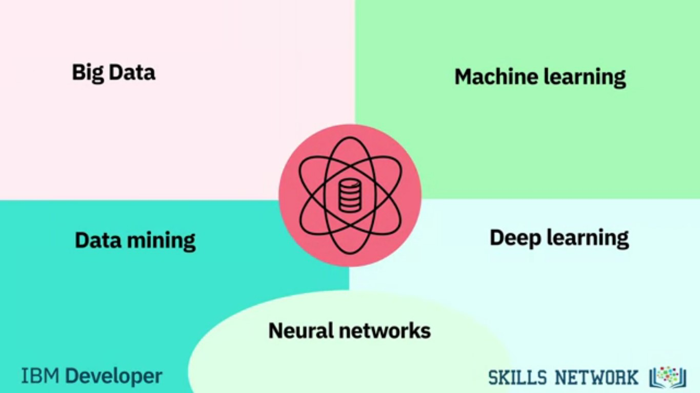
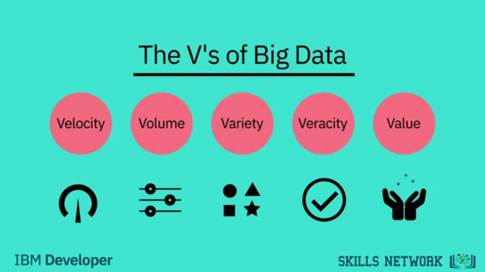
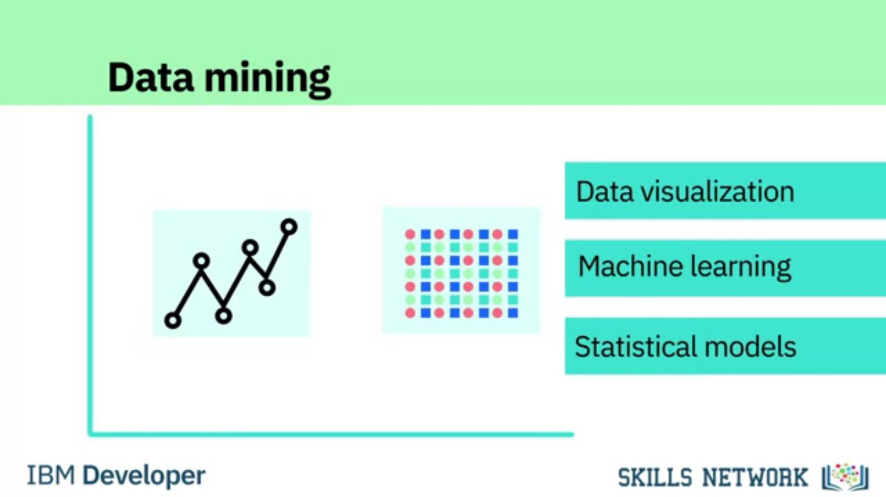
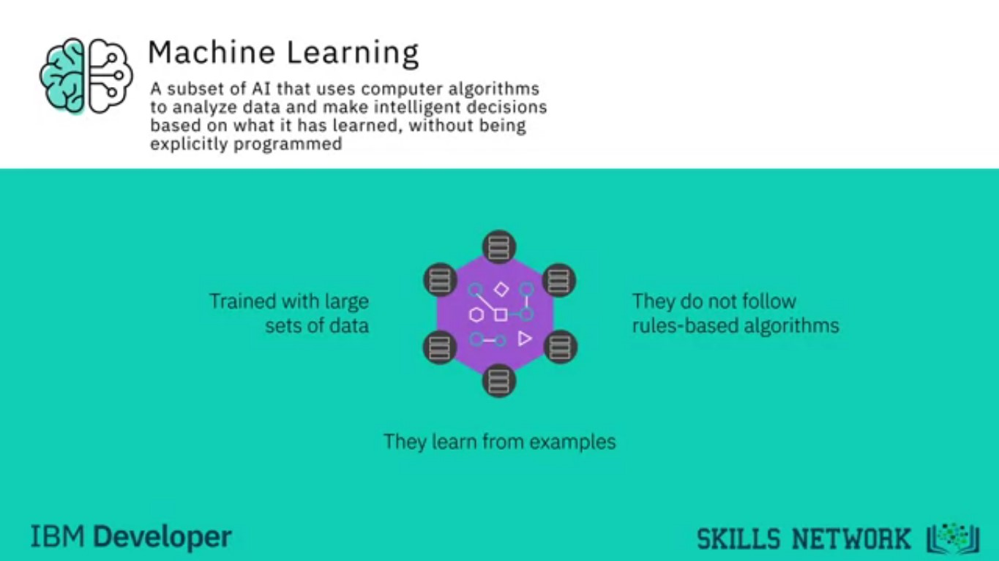
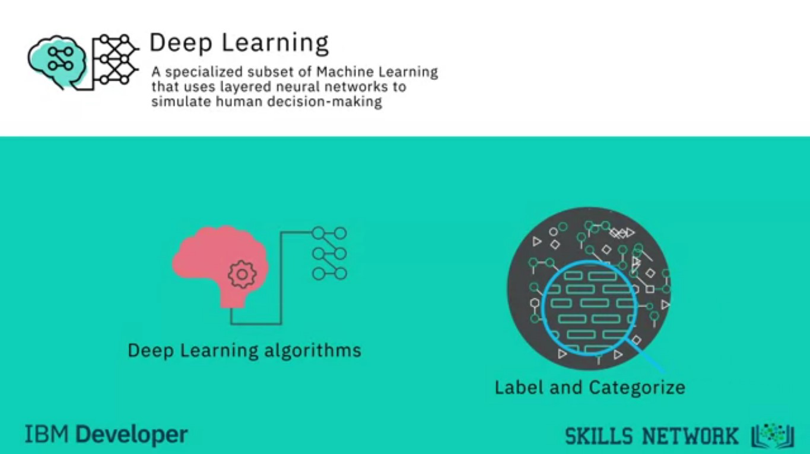
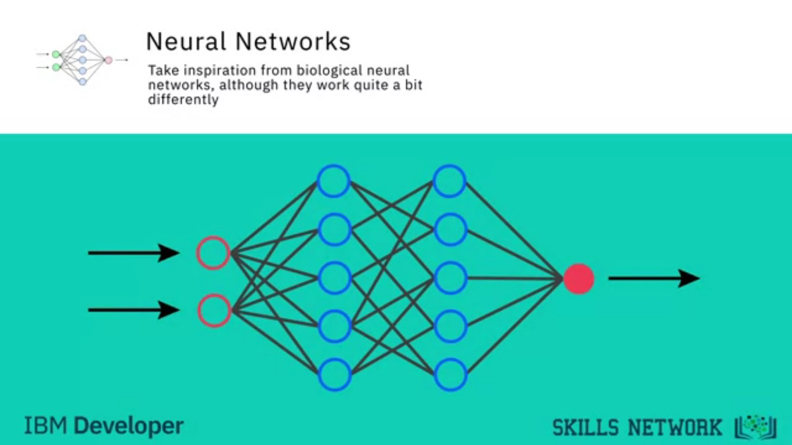
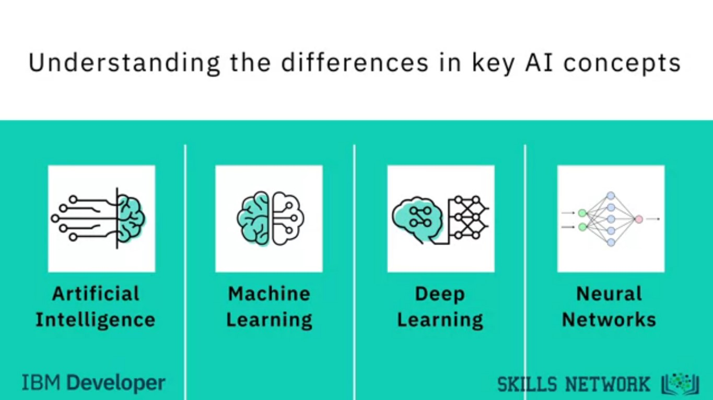
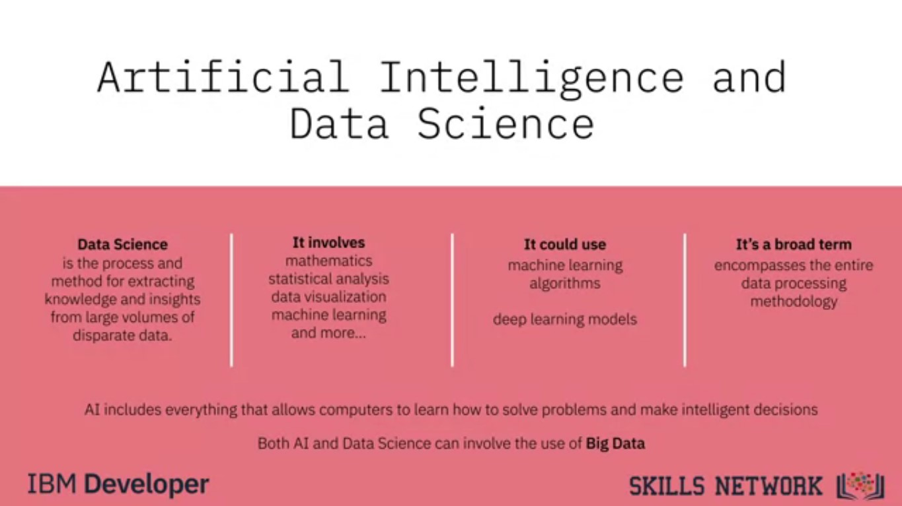

# Week 2: Data Science Topics
https://www.coursera.org/learn/what-is-datascience/home/week/2

In this module, you will hear from Norman White, the Faculty Director of the Stern Centre for Research Computing at New York University, as he talks about data science and the skills required for anyone interested in pursuing a career in this field. He also advises those looking to start a career in data science. Finally, you will complete reading assignments to learn about the process of mining a given dataset and about regression analysis.

### Learning Objectives
1. Define Big Data and its distinguishing characteristics, such as, Velocity, Volume, Veracity, and Value.
2. Describe how Hadoop and other big data tools, combined with distributed computing power, are triggering digital transformation.
3. List some of the skills required to be a data scientist and analyze big data.
4. Explain what data mining is and the steps required to mine a given a dataset.
5. Explain the difference between common data science terms, including deep learning and machine learning.
6. Describe regression and some of its applications.
7. Describe how to apply the Data Understanding and Data Preparation stages of the methodology to a data science problem.

# Big Data and Data Mining
# 2.1. Foundations of Big Data
https://www.coursera.org/learn/what-is-datascience/lecture/dxcNH/foundations-of-big-data

In this digital world, everyone leaves a trace. From our travel habits to our workouts and entertainment, the increasing number of internet connected devices that we interact with on a daily basis record vast amounts of data about us.

There’s even a name for it: **Big Data**.

#### Ernst and Young Definition
> Big Data refers to the dynamic, large and disparate volumes of data being created by people, tools, and machines. It requires new, innovative, and scalable technology to collect, host, and analytically process the vast amount of data gathered in order to derive real-time business insights that relate to consumers, risk, profit, performance, productivity management, and enhanced shareholder value.

### The V's of Big Data
There is no one definition of Big Data, but there are certain elements that are common across the different definitions, such as:
1. Velocity
2. Volume
3. Variety
4. Veracity
5. Value 

#### Velocity
Velocity is the **speed** at which data accumulates. Data is being generated extremely fast, in a process that never stops. Near or real-time streaming, local, and cloud-based technologies can process information very quickly.

#### Volume
Volume is the **scale** of the data, or the increase in the amount of data stored.

Drivers:
1. The increase in data sources
2. Higher resolution sensors
3. Scalable infrastructure

#### Variety
Variety is the **diversity** of the data.

Structured data fits neatly into rows and columns. In relational databases while unstructured data is not organized in a pre-defined way, like Tweets, blog posts, pictures, numbers, and video, variety also reflects that data comes from different sources, machines, people, and processes, both internal and external to organizations.

Drivers:
1. Mobile technologies
2. Social media
3. Wearable technologies
4. Geo technologies
5. Video
6. Etc.

#### Veracity
Veracity is the **quality** and **origin** of data, and its conformity to **facts** and **accuracy**.

Attributes:
1. Consistency
2. Completeness
3. Integrity
4. Ambiguity

Drivers:
1. Cost
2. The need for traceability

With the large amount of data available, the debate rages on about the accuracy of data in the digital age. Is the information real, or is it false?

#### Value
Value is our ability and need to turn data into value.

Value isn't just profit. It may have medical or social benefits, as well as customer, employee, or personal satisfaction. The main reason that people invest time to understand Big Data is to derive value from it.

### The V's in Action.
#### Velocity
Every 60 seconds, hours of footage are uploaded to YouTube which is generating data. Think about how quickly data accumulates over hours, days, and years.

#### Volume
The world population is approximately seven billion people and the vast majority are now using digital devices; mobile phones, desktop and laptop computers, wearable devices, and so on. These devices all generate, capture, and store data -- approximately 2.5 quintillion bytes every day. That's the equivalent of 10 million Blu-ray DVD's.

#### Variety
Let's think about the different types of data; text, pictures, film, sound, health data from wearable devices, and many different types of data from devices connected to the Internet of Things.

#### Veracity
80% of data is considered to be unstructured and we must devise ways to produce **reliable** and **accurate** insights. The data must be **categorized**, **analyzed**, and **visualized**.

### Data Analysis Tools
Data Scientists today derive insights from Big Data and cope with the challenges that these massive data sets present. The scale of the data being collected means that it’s not feasible to use conventional data analysis tools.

However, alternative tools that leverage distributed computing power can overcome this problem. Tools such as **Apache Spark**, **Hadoop** and its ecosystem provide ways to **extract**, **load**, **analyze**, and **process** the data across distributed compute resources, providing **new insights** and **knowledge**. This gives organizations more ways to connect with their customers and enrich the services they offer.

So next time you strap on your smartwatch, unlock your smartphone, or track your workout, remember your data is starting a journey that might take it all the way around the world, through big data analysis, and back to you.

# 2.2. What is Hadoop?
https://www.coursera.org/learn/what-is-datascience/lecture/kbyiw/what-is-hadoop

#### Norman White, Clinical Professor of CMS, Faculty Director, Research Computing, New York University, Stern

According to Dr. White, most of the components of data science, such as probability, statistics, linear algebra, and programming, have been around for many decades but now we have the computational capabilities to apply combine them and come up with new techniques and learning algorithms.

### What is Hadooop?
> Traditionally in computation and processing data we would bring the data to the computer. You'd wanna program and you'd bring the data into the program. In a big data cluster what Larry Page and Sergey Brin came up with is very pretty simple is they took the data and they sliced it into pieces and they distributed each and they replicated each piece or triplicated each piece and they would send it the pieces of these files to thousands of computers first it was hundreds but then now it's thousands now it's tens of thousands. And then they would send the same program to all these computers in the cluster. And each computer would run the program on its little piece of the file and send the results back. The results would then be sorted and those results would
then be redistributed back to another process.

> The first process is called a map or a mapper process and the second one was called a reduce process. Fairly simple concepts but turned out that you could do lots and lots of different kinds of handle lots and lots of different kinds of problems and very, very, very large data sets.

> So the one thing that's nice about these big data clusters is they scale linearly. You had twice as many servers and you get twice the performance and you can handle twice the amount of data. So this was just broke a bottleneck for all the major social media companies.

> Yahoo then got on board. Yahoo hired someone named Doug Cutting who had been working on a clone or a copy of the Google big data architecture and now that's called Hadoop. And if you google Hadoop you'll see that it's now a very popular term and there are many, many, many if you look at the big data ecology there are hundreds of thousands of companies out there that have some kind of footprint in the big data world.

### How does data science differ from traditional subjects like statistics?
> Most of the components of data science have been around for many, many, many, many decades. But they're all coming together now with some new nuances I guess.

Fundamentals of data science:
1. Probability
2. Statistics
3. Algebra
4. Linear algebra
5. Programming
6. Databases.

> They've all been here. But what's happened now is we now have the computational capabilities to apply some new techniques - **machine learning**. Where now we can take **really large data sets** and instead of taking a sample and trying to test some hypothesis we can take really, really large data sets and look for patterns.

> So back off one level from hypothesis testing to finding patterns that maybe will generate hypotheses.

> Now this can bother some very traditional statisticians and gets them really annoyed sometimes that you know you're supposed to have a hypothesis that is not that is independent of the data and then you test it.

> So, once some of these machine learning techniques started were really the only thing the only way you can analyze some of these really large social media data sets. So what we've seen is that the combination of traditional [technique] areas computer science probability, statistics, mathematics all coming together in this thing that we call **Decision Sciences**.

> Our department at Stern I'll give a little plug here we happen to have been very well situated among business schools because we're one of the few business schools that has a real statistics department with real PhD level statisticians in it. We have an operations management department and an information systems department. So we have a wide range of computer scientists to statisticians, to operations researchers. And so we were like perfectly positioned as a couple of other business schools were to jump on this bandwagon and say; okay this is Decision Sciences. And Foster Provost who's in my department was the first director of the NYU Center for Data Science.

### Do you recall a time when no one spoke about data science?
> Four years ago maybe five years ago.

> I mean, I feel this is one of those cases where you can just to Google and search for data science and see how often it occurred and you'll see almost nothing and then just a spike. The same thing you would see with big data about seven or eight years ago. So data science is a term I haven't heard of probably five years ago.

### What did you think when you first heard the term 'data science'?
> The first question is what is it? And I think faculty and everybody is still trying to get their hands around exactly what is business analytics and what is data science. We certainly know the components of it. But it's morphing and changing and growing. I mean the last three years deep learning has just been added into the mix. Neural networks have been around for 20 or 30 years. 20 years ago, I would teach neural networks in a class and you really couldn't do very much with them. And now some researchers have come up with multi-layer neural networks in Toronto in particular the University of Toronto. And that technology is now rapidly expanding it's being used by Google, by Facebook, by lots of companies.

# 2.3. How Big Data is Driving Digital Transformation
https://www.coursera.org/learn/what-is-datascience/lecture/kt5UL/how-big-data-is-driving-digital-transformation

Digital Transformation affects business operations, updating existing processes and operations and creating new ones to harness the benefits of new technologies.

This digital change integrates digital technology into all areas of an organization resulting in fundamental changes to how it operates and delivers value to customers. It is an organizational and cultural change driven by **Data Science**, and especially **Big Data**.

The availability of vast amounts of data, and the competitive advantage that analyzing it brings, has triggered digital transformations throughout many industries.

1. Netflix moved from being a postal DVD lending system to one of the world’s foremost video streaming providers
2. The Houston Rockets NBA team used data gathered by overhead cameras to analyze the most productive plays.
3. Lufthansa analyzed customer data to improve its service.

#### Example of Big Data triggering a digital transformation in an entire industry

In 2018, the Houston Rockets, a National Basketball Association, or NBA team, raised their game using Big Data. The Rockets were one of four NBA teams to install a video tracking system which mined raw data from games. They analyzed video tracking data to investigate which plays provided the best opportunities for high scores, and discovered something surprising.

Data analysis revealed that the shots that provide the best opportunities for high scores are two-point dunks from inside the two-point zone, and three-point shots from outside the three-point line, not long-range two-point shots from inside it. This discovery entirely changed the way the team approached each game, increasing the number of three-point shots attempted.

In the 2017-18 season, the Rockets made more three-point shots than any other team in NBA history, and this was a major reason they won more games than any of their rivals. In basketball, Big Data changed the way teams try to win, transforming the approach to the game.

Digital transformation is not simply duplicating existing processes in digital form; the in-depth analysis of how the business operates helps organizations discover how to improve their processes and operations, and harness the
benefits of integrating data science into their workflows.

Most organizations realize that digital transformation will require fundamental changes to their approach towards data, employees, and customers, and it will affect their organizational culture.

Digital transformation impacts every aspect of the organization, so it is handled by decision makers at the very top levels to ensure success. The support of the Chief Executive Officer is crucial to the digital transformation process, as is the support of the Chief Information Officer, and the emerging role of Chief Data Officer. But they also require support from the executives who control budgets, personnel decisions, and day-to-day priorities. This is a whole organization process. Everyone must support it for it to succeed.

There is no doubt dealing with all the issues that arise in this effort requires a new mindset, but Digital Transformation is the way to succeed now and in the future.

# 2.4. Data Science Skills & Big Data
https://www.coursera.org/learn/what-is-datascience/lecture/CFO4Y/data-science-skills-big-data

### Norman White, Clinical Professor of CMS, Faculty Director, Research Computing, New York University, Stern

According to Dr. White, his students, who are mostly aspiring data scientists, need to learn many tools such as Python, UNIX commands, pandas, and Jupyter notebook.

> I'm Norman White, I'm a Clinical Faculty Member in the IOMS Department, Information, Operations and Management Science Department here at Stern. I've been here for a long time, since I got out of college, pretty much. I'm sort of a techy, geeky kind of person. I really like to play with technology in my spare time. I'm currently Faculty Director of the Stern Center for Research Computing, in which we have a private cloud that runs lots of different kinds of systems.

> Many of our faculty or PhD students who need specialized hardware and software will come to us, we'll spin up a machine for them, configure it, I'll help them and advise on them. A lot of the data scientists, or virtually all the data scientists at Stern use our facilities. And their PhD students use them a lot.

#### What did you study in your undergrad?
> I have an undergraduate degree in Applied Physics and while I was an undergrad I took a number of economics courses, so I ended up deciding to go to business school, but I had, this was in the early days of computers and I had gotten interested in computers. I came to Stern, which was then NYU Business School downtown and they had a little computer center, and I decided that I was gonna learn two things while I was there. One, I was gonna learn how to program. I had taken one programming course in college. And I was gonna learn how to touch type.

> I never did learn how to touch type. Or maybe I did but I've forgotten now, and back to two finger pecking. But I became a self taught programmer, and then I took a number of courses at IBM because I eventually came the director of the computer center, while I was getting my PhD in Economics and Statistics at Stern.

> In 1973, the school formed a department called Computer Applications and Information Systems and I was one of the first faculty members in the department and I've been here ever since.

#### What does your typical Monday look like?
> My typical Monday is, I usually get in around 11 o'clock and I do my email at home first, but I come in and I have two classes on Monday. I have a class on design and development of web based systems at six o'clock. Two o'clock, I have a dealing with data class. The class is based on Python notebooks, so we start with the basics of Unix and Linux, just to get the students used to that. We move onto some Python, some regular expressions, a lot of relational databases, some Python Pandas, which is sort of like R for Python, lets you do mathematical and statistical calculations in Python. And then I end up with big data, for which, as you probably know, I'm an evangelist.

> The students I have, weekly homeworks. I put them in teams and they have to do a big project at the end of the term, and they do some really cool things.

#### Do you use Jupyter Notebooks?
> Yes, in fact, the whole course is taught using Jupyter notebooks. Every student has their own virtual machine on Amazon Web Services, so we pre-configure all the machines and they get a standard image that has all of the materials for the course either loaded on it or in a Jupyter notebook, there are the commands to download it or update the server with the right software. So everybody is in the same environment, it doesn't matter what kind of, whether they have a Mac or a Windows machine or how old it is, everybody can do everything in the class.

# 2.5. Data Scientists at New York University
https://www.coursera.org/learn/what-is-datascience/lecture/ivDZx/data-scientists-at-new-york-university

### Norman White, Clinical Professor of CMS, Faculty Director, Research Computing, New York University, Stern

Data science and business analytics became very hot subjects recently, since around the year 2012.

According to Dr. White:
1. Big data was started by Google when Google tried to figure out how how to solve their PageRank algorithm.
2. Big data is is data that is large enough and has enough volume and velocity that you cannot handle it with traditional data database systems.

> Everybody knows how to program, at least a little bit. They all have a little bit of programming background at least, and some of them have a lot. Some of them are Masters of Science and Computer Science, some of them are MBA students who've come in from technical fields and programmed every day. And others are ones who maybe took a programming course in college four or five years ago but at least they can think computationally, which I think is the most important thing that they need.

#### Are data science skills becoming more important in the work place?
> Data science and business analytics have become very hot subjects in the last four or five years. We have new tools, we have new approaches, and we have lots and lots of data that traditional techniques just couldn't really store and handle. I think the word is out. I think at this point, at first, companies and employers understood the need, especially in certain fields. I can remember talking to a major bank three years ago about big data and there was one little group in the bank where one person had a little effort in putting a little cluster together. Now that same bank has five or six major big data clusters and they're putting all of their credit card data in it and they're grinding it upside down and sideways, using all sorts of data science kinds of techniques.

> Two years ago, or was it last year, I think, our undergraduate dealing with data course had 28 students in it. This year it has 140. So that means that the parents are now beginning to get the word, because one thing we understand with our undergrads is the parents who are paying very hefty tuitions, they, you know, they tell their sons and daughters, "You know, you should be an accountant," right? Or, "You should go into financial services, "or into marketing, 'cause this is where the money is." Now, they're getting the word that maybe you should take some more STEM classes in high school and be ready to go into data science or go into fields where analytics has become more and more important.

#### What is Big Data?
> It depends on who you are. I have my own definition of big data.

> My definition of big data is data that is large enough and has enough volume and velocity that you cannot handle it with traditional database systems.

> Some of our statisticians think big data is something you can't fit on a thumb drive.

> Big data, to me, was started by Google. When Google tried to figure out how they were, when Larry Page and Sergey Brin wanted to, basically, figure out how to solve their page rank algorithm, there was nothing out there. They were trying to store all of the web pages in the world, and there was no technology, there was no way to do this, and so they went out and developed this approach, which has now become, Hadoop has copied it, but this is where all these large, big data clusters are found.

> But big data has now also expanded into, how do you analyze? There are new analytical techniques and statistical techniques for handling these really, really, really large data sets. We'll probably get to deep learning at some point along here.

# 2.6. Data Mining
https://www.coursera.org/learn/what-is-datascience/ungradedWidget/Xo4pI/data-mining

#### Course Text Book: ‘Getting Started with Data Science’ Publisher: IBM Press; 1 edition (Dec 13 2015) Print.
#### Author: Murtaza Haider
Prescribed Reading: Chapter 12 Pg. 529-531

## Establishing Data Mining Goals
The first step in data mining requires you to set up goals for the exercise. Obviously, you must identify the key questions that need to be answered. However, going beyond identifying the key questions are the concerns about the costs and benefits of the exercise. Furthermore, you must determine, in advance, the expected level of accuracy and usefulness of the results obtained from data mining. If money were no object, you could throw as many funds as necessary to get the answers required. However, the cost-benefit trade-off is always instrumental in determining the goals and scope of the data mining exercise. The level of accuracy expected from the results also influences the costs. High levels of accuracy from data mining would cost more and vice versa. Furthermore, beyond a certain level of accuracy, you do not gain much from the exercise, given the diminishing returns. Thus, the cost-benefit trade-offs for the desired level of accuracy are important considerations for data mining goals.

## Selecting Data
The output of a data-mining exercise largely depends upon the quality of data being used. At times, data are readily available for further processing. For instance, retailers often possess large databases of customer purchases and demographics. On the other hand, data may not be readily available for data mining. In such cases, you must identify other sources of data or even plan new data collection initiatives, including surveys. The type of data, its size, and frequency of collection have a direct bearing on the cost of data mining exercise. Therefore, identifying the right kind of data needed for data mining that could answer the questions at reasonable costs is critical.

## Preprocessing Data
Preprocessing data is an important step in data mining. Often raw data are messy, containing erroneous or irrelevant data. In addition, even with relevant data, information is sometimes missing. In the preprocessing stage, you identify the irrelevant attributes of data and expunge such attributes from further consideration. At the same time, identifying the erroneous aspects of the data set and flagging them as such is necessary. For instance, human error might lead to inadvertent merging or incorrect parsing of information between columns. Data should be subject to checks to ensure integrity. Lastly, you must develop a formal method of dealing with missing data and determine whether the data are missing randomly or systematically.

If the data were missing randomly, a simple set of solutions would suffice. However, when data are missing in a systematic way, you must determine the impact of missing data on the results. For instance, a particular subset of individuals in a large data set may have refused to disclose their income. Findings relying on an individual's income as input would exclude details of those individuals whose income was not reported. This would lead to systematic biases in the analysis. Therefore, you must consider in advance if observations or variables containing missing data be excluded from the entire analysis or parts of it.

## Transforming Data
After the relevant attributes of data have been retained, the next step is to determine the appropriate format in which data must be stored. An important consideration in data mining is to reduce the number of attributes needed to explain the phenomena. This may require transforming data reduction algorithms, such as Principal Component Analysis (demonstrated and explained later in the chapter), can reduce the number of attributes without a significant loss in information. In addition, variables may need to be transformed to help explain the phenomenon being studied. For instance, an individual's income may be recorded in the data set as wage income; income from other sources, such as rental properties; support payments from the government, and the like. Aggregating income from all sources will develop a representative indicator for the individual income.

Often you need to transform variables from one type to another. It may be prudent to transform the continuous variable for income into a categorical variable where each record in the database is identified as low, medium, and high-income individual. This could help capture the non-linearities in the underlying behaviors.

## Storing Data
The transformed data must be stored in a format that makes it conducive for data mining. The data must be stored in a format that gives unrestricted and immediate read/write privileges to the data scientist. During data mining, new variables are created, which are written back to the original database, which is why the data storage scheme should facilitate efficiently reading from and writing to the database. It is also important to store data on servers or storage media that keeps the data secure and also prevents the data mining algorithm from unnecessarily searching for pieces of data scattered on different servers or storage media. Data safety and privacy should be a prime concern for storing data.

## Mining Data
After data is appropriately processed, transformed, and stored, it is subject to data mining. This step covers data analysis methods, including parametric and non-parametric methods, and machine-learning algorithms. A good starting point for data mining is data visualization. Multidimensional views of the data using the advanced graphing capabilities of data mining software are very helpful in developing a preliminary understanding of the trends hidden in the data set.

Later sections in this chapter detail data mining algorithms and methods.

## Evaluating Mining Results
After results have been extracted from data mining, you do a formal evaluation of the results. Formal evaluation could include testing the predictive capabilities of the models on observed data to see how effective and efficient the algorithms have been in reproducing data. This is known as an "in-sample forecast". In addition, the results are shared with the key stakeholders for feedback, which is then incorporated in the later iterations of data mining to improve the process.

Data mining and evaluating the results becomes an iterative process such that the analysts use better and improved algorithms to improve the quality of results generated in light of the feedback received from the key stakeholders.

# Deep Learning and Machine Learning
# 2.7. What's the Difference?
https://www.coursera.org/learn/what-is-datascience/lecture/DwDPU/whats-the-difference

### Big Data
The term **big data** refers to data sets that are **so massive**, so **quickly built**, and **so varied** that they defy traditional analysis methods such as you might perform with a relational database.

The concurrent development of enormous compute power in distributed networks and new tools and techniques for data analysis means that organizations now have the power to analyze these vast data sets. A new knowledge and insights are becoming available to everyone.

Big data is often described in terms of five V's:
1. Velocity
2. Volume
3. Variety
4. Veracity
5. Value

### Data Mining

Data mining is the process of automatically **searching** and **analyzing** data, discovering previously unrevealed **patterns**. It involves **preprocessing** the data to prepare it and transforming it into an appropriate format.

Once this is done, **insights** and **patterns** are **mined** and **extracted** using various tools and techniques ranging from simple data visualization tools to machine learning and statistical models.

### Machine Learning

Machine learning is a subset of AI that uses computer algorithms to **analyze** data and make **intelligent decisions** based on what it is learned without being explicitly programmed.

Machine learning algorithms are **trained** with large sets of data and they **learn from examples**. They do not follow rules-based algorithms. Machine learning is what enables machines to solve problems on their own and make accurate predictions using the provided data.

### Deep Learning

Deep learning is a specialized subset of machine learning that uses **layered neural networks** to simulate **human decision-making**.

Deep learning algorithms can **label** and **categorize information** and **identify patterns**. It is what enables AI systems to continuously learn on the job and improve the quality and accuracy of results by determining whether decisions were correct.

### Artificial Neural Networks

Artificial neural networks, often referred to simply as neural networks, take inspiration from **biological neural networks**, although they work quite a bit differently. A neural network in AI is a collection of **small computing units** called **neurons** that take incoming data and learn to make decisions over time.

Neural networks are often layer-deep and are the reason deep learning algorithms become more efficient as the data sets increase in volume, as opposed to other machine learning algorithms that may plateau as data increases.

## AI vs Data Science

Data Science is the process and method for **extracting knowledge** and **insights** from **large volumes** of **disparate data**.

It's an **interdisciplinary field** involving **mathematics**, **statistical analysis**, **data visualization**, **machine learning**, and more. It's what makes it possible for us to appropriate information, see patterns, find meaning from large volumes of data and use it to make decisions that drive business.

Data Science can use many of the AI techniques to derive insight from data. For example, it could use machine learning algorithms and even deep learning models to extract meaning and draw inferences from data.

There is some interaction between AI and Data Science, but one is not a subset of the other. Rather, Data Science is a **broad term** that encompasses the entire data processing methodology while AI includes everything that allows computers to **learn** how to solve problems and make **intelligent decisions**.

Both AI and Data Science can involve the use of big data. That is, significantly large volumes of data.

# 2.8. Neural Networks and Deep Learning
https://www.coursera.org/learn/what-is-datascience/lecture/7oAMJ/neural-networks-and-deep-learning

Neural networks have been around for decades, but were abandoned for some time because they were computationally very expensive.

Use cases for deep learning:
1. Classifying images at a large scale.
2. Speech recognition.

> It's, I guess, Computer Sciences attempt to mimic real, the neurons, in how our brain actually functions. So 20-23 years ago, a neural network would have some inputs that would come in. They would be fed into different processing nodes that would then do some transformation on them and aggregate them or something, and then maybe go to another level of nodes and finally there would some output would come out, and I can remember training a neural network to recognize digits, handwritten digits and stuff.

#### How does a neural network work?
> So a neural network is trying to use computer, a computer program that will mimic how neurons, how our brains use neurons to process thing, neurons and synapses and building these complex networks that can be trained. So this neural network starts out with some inputs and some outputs, and you keep feeding these inputs in to try to see what kinds of transformations will get to these outputs and you keep doing this over, and over, and over again in a way that this network should converge. So these input, the transformations will eventually get these outputs.

> Problem with neural networks was that even though the theory was there and they did work on small problems like recognizing handwritten digits and things like that. They were computationally very intensive and so they went out of favor and I stopped teaching them probably 15 years ago.

> And then all of a sudden we started hearing about deep learning, heard the term deep learning. This is another term, when did you first hear it? Four years ago, five years ago? And so, I finally said, what the hell is deep learning? It's really doing all this great stuff, what is it? And I Google, I was like, this is neural networks on steroids.

> What they did was they just had multiple layers of neural networks, and they use lots, and lots, and lots of computing power to solve them. Just before this interview, I had a young faculty member in the marketing department whose research is partially based on deep learning and so she needs a computer that has a Graphics Processing Unit in it, because it takes enormous amount of matrix and linear algebra calculations to actually do all of the mathematics that you need in neural networks.

> But they've been they are now quite capable. We now have neural networks and deep learning that can recognize speech, can recognize people, you got there, getting your face recognized. I guarantee that NSA has a lot of work going on in neural networks. The university right now, as director of research computing, I have some small set of machines down at our south data center, and I went in there last week and there were just piles, and piles, and piles of cardboard boxes all from Dell with a GPU on the side. Well, the GPU is a Graphics Processing Unit.

> There's only one application in this University that needs two hundred servers each with Graphics Processing Units in it, and each Graphics Processing Unit, it has like the equivalent of 600 cores of processing. So this is tens of thousands of processing cores that is for deep learning, I guarantee.

#### What are some of the use cases of deep learning?
> Some of the first ones are speech recognition, who teaches the deep learning class at NYU, and is also the head data scientist at Facebook comes into class with a notebook, and it's a pretty thick notebook. It looks a little odd, because it's like this and it's that thick because it has a couple of Graphics Processing Units in it, and then he will ask the class to start to speak to this thing. And it will train while he's in class, he will train a neural network to recognize speech.

> So recognizing speech, recognizing people, images, classifying images, almost all of the the traditional tasks that neural nets used to work on in little tiny things, now, they can do really, really, really large things. It will learn on its own, the difference between a cat and a dog, and different kinds of objects, it doesn't have to be taught. It doesn't, it just learns that's why they call it deep learning, and if you hear, he plays this, if you hear how it recognizes speech and generate speech. It sounds like a baby who learning to talk. You can just, you're like really do about all of a sudden this stupid machine is talking to you and learned how to talk. That's cool.

#### How can one get started with neural networks?
> I need to learn some linear algebra, a lot of this a lot of this stuff is based on matrix and linear algebra. So you need to know how to do use linear algebra do transformations.

> Now, on the other hand, there's now lots of packages out there that will do deep learning and they'll do all the linear algebra for you, but you should have some idea of what is happening underneath.

> Deep learning, particularly needs really high-powered computational power. So it's not something that you're going to go out and do on your notebook for it. You could play with it. But if you really want to do it, seriously, you have to have some special computational resources.

# 2.9. Applications of Machine Learning
https://www.coursera.org/learn/what-is-datascience/lecture/dpvuM/applications-of-machine-learning

Netflix uses machine learning to recommend movies to you based on movies that you have already watched and liked or disliked.

### Norman White, Clinical Professor of CMS, Faculty Director, Research Computing, New York University, Stern

> Everybody now deals with machine learning. But recommender systems are certainly one of the major applications.

> Classifications, cluster analysis, trying to find some of the marketing questions from 20 years ago, market basket analysis, what goods tend to be bought together. That was computationally a very difficult problem, I mean we're now doing that all the time with machine learning.

> So predictive analytics is another area of machine learning. We're using new techniques to predict things that statisticians don't particularly like. Decision trees, Bayesian Analysis, naive Bayes, lots of different techniques. The nice thing about them is that in packages like R now, you really have to understand how these techniques can be used and you don't have to know exactly how to do them but you have to understand what their meanings are.

> Precision versus recall and the problems of over sampling and over fitting so you can, someone who knows a little about data science can apply these techniques but they really need to know, maybe not the details of the technique as much as how, what the trade-offs are.

### Jeff Sternberg, Data Engineering Director, Ipreo
> So, some applications of machine learning in fintech are probably the - couple of different things I could talk about there.

> One of them is recommendations. Right, so, when you use Netflix, or you use Facebook, or a lot of different software services, the recommendations are served to you. Meaning, "Hey, you're a user, you've watched this show, so maybe you'd like to see this other show." Right, or, you follow this person, so maybe you should follow this other person.

> It's actually kind of the same thing in fintech, right. Because you've looked at - if you're an investment professional, right, and because you've looked at this investment idea, it might be really cool for you to look at this other investment idea, which is kind of similar. Right, it's a similar kind of asset, it's a similar kind of company. Or it's a similar kind of technique for doing the investment. So, We can apply recommendations using machine learning throughout a lot of different parts of fintech.

> Another one that people talk about, and is important especially on retail, in the retail aspects of banking and finance is fraud detection. Trying to determine whether a charge that comes a credit card is fraudulent or not, in real time, is a machine learning problem. Right, you have to learn from all of the transactions that have happened previously and build a model, and when the charge comes through you have to compute all this stuff and say, "Yeah we think that's ok," or "hmm, that's not so good. Let's route it to, you know, our fraud peope to check."

# 2.10. Regression
https://www.coursera.org/learn/what-is-datascience/ungradedWidget/zKYTf/regression

#### Course Text Book: ‘Getting Started with Data Science’ Publisher: IBM Press; 1 edition (Dec 13 2015) Print.
#### Author: Murtaza Haider
Prescribed Reading: Chapter 7 Pg. 235-236

You might have noticed that taller parents often have tall children who are not necessarily taller than their parents and that's a good thing. This is not to suggest that children born to tall parents are not necessarily taller than the rest. That may be the case, but they are not necessarily taller than their own "tall" parents. Why I think this to be a good thing requires a simple mental simulation. Imagine if every successive generation born to tall parents were taller than their parents, in a matter of a couple of millennia, human beings would become uncomfortably tall for their own good, requiring even bigger furniture, cars, and planes.

Sir Frances Galton in 1886 studied the same question and landed upon a statistical technique we today know as regression models. This chapter explores the workings of regression models, which have become the workhorse of statistical analysis. In almost all empirical pursuits of research, either in the academic or professional fields, the use of regression models, or their variants, is ubiquitous. In medical science, regression models are being used to develop more effective medicines, improve the methods for operations, and optimize resources for small and large hospitals. In the business world, regression models are at the forefront of analyzing consumer behavior, firm productivity, and competitiveness of public and private sector entities.

I would like to introduce regression models by narrating a story about my Master's thesis. I believe that this story can help explain the utility of regression models.

### The Department of Obvious Conclusions
In 1999, I finished my Masters' research on developing hedonic price models for residential real estate properties. It took me three years to complete the project involving 500,000 real estate transactions. As I was getting ready for the defense, my wife generously offered to drive me to the university. While we were on our way, she asked, "Tell me, what have you found in your research?". I was delighted to be finally asked to explain what I have been up to for the past three years. "Well, I have been studying the determinants of housing prices. I have found that larger homes sell for more than smaller homes," I told my wife with a triumphant look on my face as I held the draft of the thesis in my hands.

We were approaching the on-ramp for a highway. As soon as I finished the sentence, my wife suddenly turned the car to the shoulder and applied brakes. As the car stopped, she turned to me and said: "I can't believe that they are giving you a Master's degree for finding just that. I could have told you that larger homes sell for more than smaller homes."

At that very moment, I felt like a professor who taught at the department of obvious conclusions. How can I blame her for being shocked that what is commonly known about housing prices will earn me a Master's degree from a university of high repute?

I requested my wife to resume driving so that I could take the next ten minutes to explain to her the intricacies of my research. She gave me five minutes instead, thinking this may not require even that. I settled for five and spent the next minute collecting my thoughts. I explained to her that my research has not just found the correlation between housing prices and the size of housing units, but I have also discovered the magnitude of those relationships. For instance, I found that all else being equal, a term that I explain later in this chapter, an additional washroom adds more to the housing price than an additional bedroom. Stated otherwise, the marginal increase in the price of a house is higher for an additional washroom than for an additional bedroom. I found later that the real estate brokers in Toronto indeed appreciated this finding. I also explained to my wife that proximity to transport infrastructure, such as subways, resulted in higher housing prices. For instance, houses situated closer to subways sold for more than did those situated farther away. However, houses near freeways or highways sold for less than others did. Similarly, I also discovered that proximity to large shopping centers had a nonlinear impact on housing prices. Houses located very close (less than 2.5 km) to the shopping centers sold for less than the rest. However, houses located closer (less than 5 km, but more than 2.5 km) to the shopping center sold for more than did those located farther away. I also found that the housing values in Toronto declined with distance from downtown.

As I explained my contributions to the study of housing markets, I noticed that my wife was mildly impressed. The likely reason for her lukewarm reception was that my findings confirmed what we already knew from our everyday experience. However, the real value added by the research rested in quantifying the magnitude of those relationships.

### Why Regress?
A whole host of questions could be put to regression analysis. Some examples of questions that regression (hedonic) models could address include:

- How much more can a house sell for an additional bedroom?
- What is the impact of lot size on housing price?
- Do homes with brick exteriors sell for less than homes with stone exteriors?
- How much does a finished basement contribute to the price of a housing unit?
- Do houses located near high-voltage power lines sell for more or less than the rest?

# Hands-on Exercise: Data Science Exploration

# Lesson Summary
https://www.coursera.org/learn/what-is-datascience/supplement/oQJ1o/lesson-summary

In this lesson, you have learned:
1. How Big Data is defined by the Vs: Velocity, Volume, Variety, Veracity, and Value.
2. How Hadoop and other tools, combined with distributed computing power,  are used to handle the demands of Big Data.  
3. What skills are required to analyse Big Data. 
4. About the process of Data Mining, and how it produces results.
