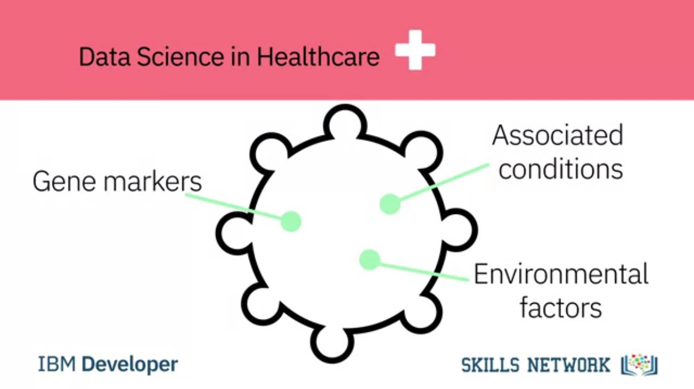

# Week 3: Data Science Topics
https://www.coursera.org/learn/what-is-datascience/home/week/3

In this module, you will learn about the approaches companies can take to start working with data science. You will learn about some of the qualities that differentiate data scientists from other professionals. You will also learn about analytics, story-telling, and the pivotal role data scientists play in creating an effective final deliverable. Finally, you will apply what you learned about data science by answering open-ended questions.

### Learning Objectives
1. Describe the application of data science in healthcare.
2. Explain how companies can start on their data science journey.
3. Describe some of the ways in which data is generated by consumers.
4. Describe how businesses such as Netflix, Amazon, UPS, Google, and Apple are using data generated by their consumers and employees.
5. List some of the qualities that differentiate data scientists from other data professionals.
6. Define the purpose of the final deliverable of a data science project and the role of storytelling in the final deliverable.
7. Describe what the final report of a Data Science project should cover and how it should be structured for best results.

# Data Science in Business

# 3.1. How Data Science is saving lives
https://www.coursera.org/learn/what-is-datascience/lecture/RvMe9/how-data-science-is-saving-lives

Using Data Science techniques to understand and analyze the large data sets available today has a huge impact on human lives. It can provide targeted information to help healthcare professionals give the best treatment to patients, or help predict natural disasters so that people can prepare early, and much more besides.

## Data Science in Healthcare

In healthcare, data scientists use predictive analytics developed from data mining, data modeling, statistics, and machine learning to find the best options for patients.

This type of predictive analytics examines all known factors for a disease, including gene markers, associated conditions, and environmental factors.

It then recommends appropriate tests, suitable trials, and any suggested treatments.

Every individual physician has their own store of knowledge gained from their studies, interests, and experiences. Data science systems that use predictive analytics ensure that all physicians can also access the latest information about the disease, tests, and treatment plans, tailored to their specific patient.

With this type of system, every physician has access to the same knowledge, and the best options can be consistently offered, improving patient outcomes. For example, a study by the Boston Consulting Group and AdvaMedDx, an industry association of medical diagnostics companies, examined the barriers to the adoption of potentially lifesaving diagnostic tests for patients with a specific cancer and a particular gene marker.

The study discovered that the biggest factor in the patient being offered a specific test was the patient’s oncologist, who may or may not have known about the test and its relationship to the gene marker. By providing extra information through data science tools, physicians can be made aware of the most helpful tests and treatments for a specific patient.

## Data Mining
There are many opportunities to explore other ways to mine data, such as from electronic medical records for different types of medical research. Schools such as the NorthShore University HealthSystem in suburban Chicago, a leader in the implementation of Electronic Medical Records (EMR) systems, now offer guidance on data mining.

It is the first healthcare provider in America to be awarded the highest level of EMR deployment for both inpatient and outpatient care. This remarkable effort has generated much-anonymized data available for innovative analytics research.

Developing more sophisticated big data analytics capabilities helps healthcare organizations move from basic descriptive analytics towards predictive insights, thanks to data science.

## Disaster Preparedness
In the field of Disaster Preparedness, the ability to save lives using Data Science tools has been under development for many years. The use of predictive analytics tools is improving and providing new data analysis in a multitude of ways, alerting populations to danger faster than ever before.

Large, high-quality data sets can be used to predict the occurrence of numerous types of natural disasters, which can be the difference between life and death for thousands of people. Earthquakes, hurricanes & tornados, floods, and volcanic eruptions can be predicted with the help of data science.

Recent research at the University of Warwick in the UK used social media content such as photos and keywords to track the development of floods, hurricanes and other weather events. When added to the information recorded by scientists and weather stations, this type of data can be used to improve the predictions for localised weather events.

Because the real benefit of this knowledge is so important, schools are starting to include this type of data science education in their curriculum. For instance, the University of Chicago Graham School offers a Master of Science course in Threat and Response Management.

Data science tools enable organizations to analyse vast quantities of data from widely different sources, and present that information in a way that allows data scientists to gain new knowledge, in some cases, saving hundreds of lives.

# 3.2. How Should Companies Get Started in Data Science?
https://www.coursera.org/learn/what-is-datascience/lecture/AAArc/how-should-companies-get-started-in-data-science

Some of the first steps that companies need to take to get started in data science:
1. Start collecting data - Without data, no data science work can be carried out
2. Put together a team of data scientists - You need competent data scientists who would use the data to help you make data-driven decisions

## Murtaza Haider, PhD, Associate Professor, Ted Rogers School of Management
> At the end of the day, for businesses, they know one thing, that if they are unable to measure something, they are unable to improve it. And if they are unable to measure their costs, they are unable to reduce them. If they're unable to measure their profits, they are unable to increase them. So the first thing a company has to do is to start recording information, start capturing data, data about costs. And the differentiate it by labor costs and material cost, the cost to how much it cost to sell one product and the total cost. And then you look at the revenue, where's your revenue coming from? Is 80% of your revenue coming from 20% of your customers? Or is it the other way around?

> So first thing first, start capturing data. Once you have data, then you can apply algorithms and analytics to it. So the first thing to do would be to capture data. If you're not capturing it, start capturing it. If you're capturing it, archive it. Do not overwrite on your old data thinking you don't need it anymore. Data never gets old. Data is always relevant, even if it's 100 years old, 200 years old. It is relevant to you and and your firm and your success. So keep data, capture it, archive it, make sure nothing goes to waste. Make sure there's a consistency. So someone 20 years later trying to understand, that data should be able to do so, so have proper documentation. Do it now. Put the best practices for data archiving in place the moment you start a business. And if you're already in business and you haven't done it, do it now.

## Stephen Sherman
> Start measuring things. Too many companies haven't measured things properly for a decade and, then they decide, they want data science. Data science inside a company is only going to be as valuable as the data collected. Garbage in, garbage out is a rule in any sort of analysis.

## Shingai Manjengwa, CEO, Fireside Analytics Inc.
> If something is not measured, it's very difficult to improve it or to change it. So the very first step is measurement. If companies have existing data, then they should start looking at it and cleaning it. If they don't have existing data, then they need to start collecting it.

## Mandeep Kaur
> I think to look for a team who love to work as a data scientist.

## Luis O. Martins
> The first stop is to have employees, that they are interested on data science. because if you don't have interest in your company, you will not have engagement.

## Diana Zarate Diaz
> Companies should remember, that it's key to have a team. So it's not one data scientist, but a team of them, that each of them have strengths in different areas of data science.

# 3.3. Applications of Data Science
https://www.coursera.org/learn/what-is-datascience/lecture/bpXlb/applications-of-data-science

Data science and big data are making an undeniable impact on businesses, changing day-to-day operations, financial analytics, and especially interactions with customers.

It's clear that businesses can gain enormous value from the insights data science can provide. But sometimes it's hard to see exactly how.

In this era of big data, almost everyone generates masses of data every day, often without being aware of it. This digital trace reveals the patterns of our online lives.

If you have ever searched for or bought a product on a site like Amazon, you'll notice that it starts making recommendations related to your search. This type of system known as a **recommendation engine** is a common application of data science.

Companies like Amazon, Netflix, and Spotify use algorithms to make specific recommendations derived from customer preferences and historical behavior. Personal assistants like Siri on Apple devices use data science to devise answers to the infinite number of questions end users may ask.

Google watches your every move in the world, you're online shopping habits, and your social media. Then it analyzes that data to create recommendations for restaurants, bars, shops, and other attractions based on the data collected from your device and your current location.

Wearable devices like Fitbits, Apple watches, and Android watches add information about your activity levels, sleep patterns, and heart rate to the data you generate.

## Business Impact
Now that we know how consumers generate data, let's take a look at how data science is impacting business. In 2011, McKinsey & Company said that data science was going to become the key basis of competition. Supporting new waves of productivity, growth, and innovation.

In 2013, UPS announced that it was using data from customers, drivers, and vehicles, in a new route guidance system aimed to save time, money, and fuel. Initiatives like this support the statement that data science will fundamentally change the way businesses compete and operate.

#### How does a firm gain a competitive advantage?

Netflix collects and analyzes massive amounts of data from millions of users, including which shows people are watching at what time a day when people pause, rewind, and fast-forward, and which shows directors and actors they search for.

Netflix can be confident that a show will be a hit before filming even begins by analyzing users preference for certain directors and acting talent, and discovering which combinations people enjoy. Add this to the success of earlier versions of a show and you have a hit.

For example, Netflix knew many of its users had streamed to the work of David Fincher. They also knew that films featuring Robin Wright had always done well, and that the British version of House of Cards was very successful.

Netflix knew that significant numbers of people who liked Fincher also liked Wright. All this information combined to suggest that buying the series would be a good investment for the company. They were right. It was a huge hit. Thanks to data science, Netflix knows what people want before they do.

# 3.4. The Final Deliverable
https://www.coursera.org/learn/what-is-datascience/ungradedWidget/R3KYL/the-final-deliverable

#### Course Text Book: ‘Getting Started with Data Science’ Publisher: IBM Press; 1 edition (Dec 13 2015) Print.
#### Author: Murtaza Haider
Prescribed Reading: Chapter 3 Pg. 52-53

## The Final Deliverable
The ultimate purpose of analytics is to communicate findings to the concerned who might use these insights to formulate policy or strategy. Analytics summarize findings in tables and plots. The data scientist should then use the insights to build the narrative to communicate the findings. In academia, the final deliverable is in the form of essays and reports. Such deliverables are usually 1,000 to 7,000 words in length. In consulting and business, the final deliverable takes on several forms. It can be a small document of fewer than 1,500 words illustrated with tables and plots, or it could be a comprehensive document comprising several hundred pages. Large consulting firms, such as McKinsey and Deloitte,I routinely generate analytics-driven reports to communicate their findings and, in the process, establish their expertise in specific knowledge domains.

Let's review the "United States Economic Forecast", a publication by the Deloitte University Press. This document serves as a good example for a deliverable that builds narrative from data and analytics. The 24-page report focuses on the state of the U.S. economy as observed in December 2014. The report opens with a **grabber** highlighting the fact that contrary to popular perception, the economic and job growth has been quite robust in the United States. The report is not merely a statement of facts.

In fact, it is a carefully crafted report that cites Voltaire and follows a distinct theme. The report focuses on the **good news** about the U.S. economy. These include the increased investment in manufacturing equipment in the U.S. and the likelihood of higher consumer consumption resulting from lower oil prices.

The Deloitte report uses time series plots to illustrate trends in markets. The GDP growth chart shows how the economy contracted during the Great Recession and has rebounded since then. The graphic presents four likely scenarios for the future. Another plot shows the changes in consumer spending. The accompanying narrative focuses on income inequality in the U.S. and refers to Thomas Pikkety's book on the same. The Deloitte report mentions many consumers did not experience an increase in their real incomes over the years, while they still maintained their level of spending. Other graphics focused on housing, business, and government sectors, international trade, labor, and financial markets, and prices. The appendix carries four tables documenting data for the four scenarios discussed in the report.

Deloitte's "United States Economic Forecast" serves the very purpose that its authors intended. The report uses data and analytics to generate the likely economic scenarios. It builds a powerful narrative in support of the thesis statement that the U.S. economy is doing much better than most would like to believe. At the same time, the report shows Deloitte to be a competent firm capable of analyzing economic data and prescribing strategies to cope with the economic challenges.

Now consider if we were to exclude the narrative from this report and presented the findings as a deck of PowerPoint slides with eight graphics and four tables. The PowerPoint slides would have failed to communicate the message that the authors carefully crafted in the report citing Piketty and Voltaire. I consider Deloitte's report a good example of storytelling with data and encourage you to read the report to decide for yourself whether the deliverable would have been equally powerful without the narrative.

Now, let us work backward from the Deloitte report. Before the authors started their analysis, they must have discussed the scope of the final deliverable. They would have deliberated the key message of the report and then looked for the data and analytics they needed to make their case. The initial planning and conceptualizing of the final deliverable is therefore extremely important for producing a compelling document. Embarking on analytics, without due consideration to the final deliverable, is likely to result in a poor-quality document where the analytics and narrative would struggle to blend.

# Careers and Recruiting in Data Science

# 3.5. How Can Someone Become a Data Scientist?
https://www.coursera.org/learn/what-is-datascience/lecture/Y1WAm/how-can-someone-become-a-data-scientist

## Norman White, Clinical Professor of CMS, Faculty Director, Research Computing, New York University, Stern

According to Dr. White, if someone is coming into a data science team, the first skills they would need are:
1. Understanding relational databases.
2. Knowing some algebra and some calculus.
3. Knowing how to program, at least have some computational thinking.
4. Knowing basic probability and some basic statistics.

> A real data scientist, the high-end data scientists, are mostly PhDs. They often come out of physics, out of statistics, they have to have a computer science background, they have to have a math background, they have to know about databases and statistics and probability and all that stuff.

> However, if you're coming into a data science team, I think the first skills you need is you need to know how to program, at least have some computational thinking, so having taken a programming course, you need to know some algebra, at least up to analytics, geometry, and hopefully some calculus, some basic probability, some basic statistics, I mean really have to understand the different statistical distributions, and database.

> I mean, one of the easiest places to start is relational databases, which stores lots and lots of our data so people can first walk before they can run by at least understanding about computers and databases and how we store things and if you understand relational databases nowadays you can still, just with that understanding, use big data clusters as if they were just a big relational database. You don't have to really have
understand the whole MapReduce programming model.

> But then, as you go further up in the field, then you have to know a lot of computer science theory and statistics, it's really, and probability, it's really the intersection of them that the high end data scientists, the PhD data scientists work with.

#### What is the role of self-learning in data science?
> I do a lot of self-learning. I think everybody these days, I mean, I learned about Hadoop all by myself, I read some articles, I watched some videos, I thought, I played, although I'm a builder, I'm a tinkerer, so if I wanna figure out how to do something, I build it. I mean, my first HPC cluster I heard about this term a Beowulf cluster, I mean, yeah, what the hell's that? So I looked it up and said, oh, it's just a bunch of computers hooked together with a TCP/ IP network, that's pretty easy, so we get a grant from Citi Bank and we built a five thing cluster and I said, oh, well, that's HPC. I said, I had one of the first HPC clusters at the university, it was tiny but a lot of our researchers loved it because they could run stuff 40 and 50 times faster.

> So I think one of the ways you learn things is you do them, you have to do them, and these online learning platforms especially now that we have things like IPython and Jupyter Notebooks and I guess Zeppelin means that you can actually go in and take some of these courses and you can do things right then and you can see them and feel them and play with them and, at that point, you know, you'll start to get your head around what is actually happening.

> Motivation is the key problem in all of these, is how to keep people motivated and I think the badge system that the, what was it, Big Data University has, is one of the ways is how do you get people to keep going through. But if they want to, they can. It's up to the individual to. So they have to understand what the goal is.

#### Where should data science fit in the organizational structure?
> The place it can't sit is probably under the CIO, the Chief Information Officer. CIOs current chief information officers in many companies got there from an accounting background or a finance background, they're clueless. Sorry. But they really, it has to come out of the research side.

> So you'll find data scientists primarily in companies that have some research agenda, pharmaceuticals, finance, all of, any technology company. If you look at, we can't keep some of our PhD data scientists in our program, they are now at Facebook, they're at Linkedin, they're at Uber, they're at Lyft, because the demand out there for the PhD level data scientist is just unbelievable. They make large amounts of money and they're playing with problems that are really, really neat. How do you schedule the Uber cars? You have enormous amounts of data.

# 3.6. Recruiting for Data Science
https://www.coursera.org/learn/what-is-datascience/lecture/d2msK/recruiting-for-data-science

- Curiosity is one of the most important skills that a data scientist should possess in addition to sense of humor and story telling.

- When hiring a data scientist, you need to ensure that the candidate is passionate about your field of work. A brilliant data scientist who is passionate about the field of IT won't necessary excel in the field of healthcare if they are passionate about it.

#### Murtaza Haider, PhD, Associate Professor, Ted Rogers School of Management, Ryerson University
> When the companies are hiring people for a data science team, maybe a data scientist or an analyst, or a chief data scientist, the tendency would be to find the person who has all the skills, that they know the domain-specific knowledge. They're excellent in analyzing structured and unstructured data. And they're great at presenting and they've got great storytelling skills. So if you put all this together, you will realize you're looking for a unicorn. And your odds of finding a unicorn are pretty rare.

> I think what you need to do to is to see, given the pool of applicants you have, who has the most resonance with your firm's DNA. Because you can teach analytics skills, anyone can learn analytics skills if they dedicate time and effort to it. But what really matters is who's passionate about the kind of business that you do. Someone could be a great data scientist in the retail environment, but they may not be that excited about working in IT related firms or working with gigabytes of weblogs. But if someone is excited about those weblogs, if someone is excited about health-related data then they would be able to contribute to your productivity much more so. And I would say if I'm looking for someone, if I have to put together a data science team, I would first look for curiosity. Is that person curious about things not just for data science but anything like, are they curious about why this room is painted a certain way, why do the bookshelves have books, and what kinds of books? They have to have a certain degree of curiosity about everything that is in their vision, that they look at.

> The second thing is do they have a sense of humor because, you see, you have to have a lighthearted about it. If someone is too serious about it, they probably would take it too seriously, and would not be able to look at the lighter elements.

> The third thing I think, and I think the last thing that I would look for if I had to have a hierarchy, the last thing I would look for are technical skills. I would go through the social skills, curiosity, and sense of humor. The ability to tell a story. The ability to know that there is a story there. And then once all is there then I would say, well, can you do the technical side of it? And if there is some hope or some sign of some technical skills, I would take them because I can train them in whatever skills they need. But I cannot teach curiosity. I cannot teach storytelling. I cannot certainly, instill sense of humor in anyone.

> From a skills point of view, let's focus on the technical skills and in that case, first thing would be what kind of a technical platform would you like to adopt? Let's say you want to work in a structured data environment and let's say you want to work in market research. Then the type of skills you need are slightly different than someone who would like to work in big data environments. If you want to work in the traditional market research data, structure data environment, your skills should be some statistical knowledge and some knowledge of basic statistical algorithms, maybe some machine learning algorithms. And these are the tools that you would like to develop. If you want to work in big data, then there's the other aspect of it and that is to be able to store data. So you start with the expertise in storing large amounts of data. And then you look into platforms that allow you to do that.

> The next step would be to be able to manipulate large amounts of data

> And the final step would be to apply algorithms to those large sets of data.

> So it's a three-step process.

> But most likely it starts, most importantly, it starts with where you would like to be, in what field, in what domain. In terms of platforms, let's you want to be in the traditional predictive analytics environment, and you're not working with big data, then R or Stata, or Python would be your tools. If you're working mostly with unstructured data, then Python is most suitable than R. If you're working with big data, then Hadoop and Spark are the environments that you will be working with. So it all depends upon where you would like to be and what kind of work excites you and then you pick your tools.

> In addition to technical skills, the second aspect of the data science is to have the ability to communicate. The communication skills or presentation skills. I call them storytelling skills, that is that you have your analysis done, now can you tell a great story from it? If you have a very large table, can you synthesize this and make it more appealing that when it goes on the screen, or is it part of a document that it just speaks? It sings the findings and the reader just gets it right there. So the ability to present your findings, either verbally, or in a presentation, or in a document. So those communication and presentation skills are equally important as the technical skills are.

> When you have a grading side, when you're presenting your results, imagine you're driving on a mountain and then there's a sharp turn. And you can't see what's beyond the turn. And then you make that turn and then suddenly, you see a tremendous valley in front of you. And this great sense of awe, that I didn't know that, right? So when you present your findings and you have this great finding and you communicate it well, this is what people feel because they were not expecting it. They were not aware of it, and then this great sense of happiness that now I know. And I didn't know this, now I know. And then it empowers them, it gives them ideas, what they can do with this knowledge, this new insight. It's a great sense of joy. And you are able as a data scientist, you are able to share with your clients because you enabled it.

#### Shingai Manjengwa, CEO, Fireside Analytics Inc.
> I think there's no hard and fast rule for hiring data scientists. I think it's going to be a case by case thing. I would say there has to be some sort of technical component, somebody should be able to work with and manipulate the data. They should be able to communicate what they find in the data. I find quite often nobody really cares about the r-square or the confidence interval. So you have to be able to introduce those things and explain something in a compelling way. And they also have to find somebody who is relatable, because data science, it been typically new means that the person in that role has to make relationships and they have to work across different departments.

#### Rafael B. Da Silva
> If these data scientist has a good mathematics and statistics background.

#### Luis O. Martins
> They have to consider like problem solving abilities and analysis. The scientist needs to be good in analyzing problems.

#### Mandeep Kaur
> The persons they are hiring, they should love to play with data. And then they know how to play with the data visualization. They have analytical thinking.

#### Stephen Sherman
> When a company is hiring anyone to work on a data science team, they need to think about what role that person is going to take.

> Before a company begins, they need to understand what they want out of their data science team. And then they need to hire to begin it. As they grow a data science team, they need to understand whether they need engineers, architects, designers to work on visualization. Or whether they just need more people who can multiply large matrices.

# 3.7. Careers in Data Science
https://www.coursera.org/learn/what-is-datascience/lecture/8ey50/careers-in-data-science

The emergence of Internet of things and advances in distributed computing have brought vast amounts of data and the technological capability to analyze it.

Now that we can extract useful insights and new knowledge, we need to know how to shape that data to focus on what to do with it and what it can do for us. 

Enter data science.
Companies like LinkedIn, Glassdoor, Indeed, and Dice track employment trends which show a career in data science moving up the list of most promising jobs
to become number one since 2016. It remains one of the top three career choices for 2020.

Dice noted that job postings are from companies in a wide variety of industries, not just tech. Global Industry Analysts Incorporated predicts that the data science platform market will grow by $314.8 billion US by 2025,
driven by a compounded growth of 38.2%.

McKinsey Global Institute warned of huge talent shortages for data and analytics by 2018.

Forrester Research Analyst Brandon Purcell said, in January of 2019, the demand for data scientists will only grow as organizations increasingly rely on data-driven insights.

We're now well into that period, and recruiters are finding it difficult to fill the growing need for talented data scientists.

What motivates someone going into a data science? For one thing, data science applies to almost any discipline. So if you have the aptitude and desire to work with data, enjoy coding, have no problem learning math and statistics, and you are a good storyteller, then you can certainly enter a data science field and excel.

For most people, this means acquiring additional tools and skills and continuously learning about new tools and techniques in the field.

The women in data science initiative spearheaded by the Stanford Institute for Computational and Mathematical Computing have committed to inspire and educate data scientists worldwide, regardless of gender and to support women in the field.

When you are seeking a career in data science, you need to make sure your skill set matches the role you are targeting. You can tailor your skill set to the specific area you want to enter, adding missing skills via one of the many excellent online training resources. Then you'll be prepared for a fascinating and rewarding career.

So now it is time to move into this field, when there are such diverse choices available and education resources that make it a reality.

# 3.8. High School Students and Data Science Careers
https://www.coursera.org/learn/what-is-datascience/lecture/9PvQU/high-school-students-and-data-science-careers

According to Dr. White, the industrial world is shifting to a new trend, and for high school students to be on the right side of this new trend, his advice to them is:
1. Try to start experimenting with building small systems that work and are useful.
2. Learn statistics.
3. To learn how to program.
4. Take a course in probability.
5. Learn some math.

## Norman White, Clinical Professor of CMS, Faculty Director, Research Computing, New York University, Stern

1. Learn how to program.
2. Learn some math.
3. Take a course in probability.
4. Learn a little bit of statistics. Play- build something, write something

> I mean, when I say build, programming and building systems, building things isn't just physical, right? You can build computer systems, statistical systems, whatever. But once you try to do something, then you'll know what tools you need, right? And you'll say, "Oh, oh my god, what? "There's this expression there, "what does an inner product mean? "What's that? "How do I, oh, okay, I can learn that." And then when they get to college, they will have a big jump on many of the other college students. And so when they get out of college, they'll have an even bigger jump, and then make a lot of money. And they'll be happy, too. This stuff is fun, right? It's fun.

## Jeff Sternberg, Data Engineering Director, Ipreo
> If you're in high school and you're considering data science, I would say get familiar with data bases, start learning SQL, start thinking about, you know, computer science, if that's interesting. If you have a computer science course in your
school, you know, take it, and that's a good part of being a data scientist.

> Beyond that there are probably ways to foster your creativity, right, your curiosity. If you like detective games, that's kind of cool, right. And if you like treasure hunts or whatever, right, if you're into that stuff, I think you'll, and you get the opportunity to do that stuff, that will help you as a data scientist because it's a really a good way to kind of make sure that you can be curious as you go about your daily life.

#### What would you say to parents about data science careers?
> Encourage the curiosity, encourage the experimentation. It's kind of like science fairs, science fairs are great, they encourage that experimentation, that learning from, asking a question and answering it through a scientific method, but doing that with data sets rather than vinegar volcanoes. It's kind of the same thing, but learning from data and we're going through an election season right now, there's a lot of stuff in the news about polls and survey results and that's a great way to start a conversation and talk about how do the people who ran the polls, how do they know, how can they predict what's going to happen in the election. So that's another cool way to start a conversation about data science.

#### What would you say to high school educators about data science careers?
> I would say encourage the person who is interested in data science because to pursue is. Because it's a great career and it is something that is definitely going to be in need in the future. It's one of those highly sought after knowledge professions that are really important to businesses around the world. So being a data scientist and being able to help companies as they grow and learn how do to things more efficiently or how to do things smarter, there will always be a need for people like that. And data scientists are those people.

#### What would you say to someone who is nervous about math?
> I would say that I understand what you're talking about because I was never a great mathematics student as well. And I think there's actually a bunch of data
scientist, who are really successful and popular, who are in the same boat. You know there's kind of arithmetic and math in school is not necessarily everybody's best subject. But when you combine it with, you know these aren't just hypothetical numbers, these aren't just, problem statements that you have no connection to. When you have a connection to the problem, it suddenly becomes much easier to use math to help understand it, I found. And so you know, knowing the people who will benefit from the math that you do I think is really cool.

# 3.9. The Report Structure
https://www.coursera.org/learn/what-is-datascience/ungradedWidget/13zwm/the-report-structure

#### Course Text Book: ‘Getting Started with Data Science’ Publisher: IBM Press; 1 edition (Dec 13 2015) Print.
#### Author: Murtaza Haider
Prescribed Reading: Chapter 3 Pg. 60-62

## The Report Structure
Before starting the analysis, think about the structure of the report. Will it be a brief report of five or fewer pages, or will it be a longer document running more than 100 pages in length? The structure of the report depends on the length of the document. A brief report is more to the point and presents a summary of key findings. A detailed report incrementally builds the argument and contains details about other relevant works, research methodology, data sources, and intermediate findings along with the main results.

I have reviewed reports by leading consultants including Deloitte and McKinsey. I found that the length of the reports varied depending largely on the purpose of the report. Brief reports were drafted as commentaries on current trends and developments that attracted public or media attention. Detailed and comprehensive reports offered a critical review of the subject matter with extensive data analysis and commentary. Often, detailed reports collected new data or interviewed industry experts to answer the research questions.

Even if you expect the report to be brief, sporting five or fewer pages, I recommend that the deliverable follow a prescribed format including the cover page, table of contents, executive summary, detailed contents, acknowledgments, references, and appendices (if needed).

I often find the cover page to be missing in documents. It is not the inexperience of undergraduate students that is reflected in submissions that usually miss the cover page. In fact, doctoral candidates also require an explicit reminder to include an informative cover page. I hasten to mention that the business world sleuths are hardly any better. Just search the Internet for reports and you will find plenty of reports from reputed firms that are missing the cover page.

At a minimum, the cover page should include the title of the report, names of authors, their affiliations, and contacts, the name of the institutional publisher (if any), and the date of publication. I have seen numerous reports missing the date of publication, making it impossible to cite them without the year and month of publication. Also, from a business point of view, authors should make it easier for the reader to reach out to them. Having contact details at the front makes the task easier.

"A table of contents (ToC)" is like a map needed for a trip never taken before. You need to have a sense of the journey before embarking on it. A map provides a visual proxy for the actual travel with details about the landmarks that you will pass by in your trip. The ToC with main headings and lists of tables and figures offers a glimpse of what lies ahead in the document. Never shy away from including a ToC, especially if your document, excluding cover page, table of contents, and references, is five or more pages in length.

Even for a short document, I recommend an "abstract" or an "executive summary". Nothing is more powerful than explaining the crux of your arguments in three paragraphs or less. Of course, for larger documents running a few hundred pages, the executive summary could be longer. An "introductory section" is always helpful in setting up the problem for the reader who might be new to the topic and who might need to be gently introduced to the subject matter before being immersed in intricate details. A good follow-up to the introductory section is a review of available relevant research on the subject matter. The length of the literature review section depends upon how contested the subject matter is. In instances where the vast majority of researchers have concluded in one direction, the literature review could be brief with citations for only the most influential authors on the subject. On the other hand, if the arguments are more nuanced with caveats aplenty, then you must cite the relevant research to offer adequate context before you embark on your analysis. You might use the literature review to highlight gaps in the existing knowledge, which your analysis will try to fill. This is where you formally introduce your research questions and hypothesis.

In the "methodology" section, you introduce the research methods and data sources you used for the analysis. If you have collected new data, explain the data collection exercise in some detail. You will refer to the literature review to bolster your choice for variables, data, and methods and how they will help you answer your research questions.

The results section is where you present your empirical findings. Starting with descriptive statistics (see **Chapter 4, "Serving Tables"**) and illustrative graphics (**see Chapter S, "Graphic Details" for plots and Chapter 10, "Spatial Data Analytics" for maps**), you will move toward formally testing your hypothesis (**see Chapter 6, "Hypothetically Speaking"**).

In case you need to run statistical models, you might turn to regression models (**see Chapter 7, "Why Tall Parents Don't Have Even Taller Children"**) or categorical analysis (**see Chapters 8, "To Be or Not to Be" and 2., "Categorically Speaking About Categorical Data"**). If you are working with time-series data, you can turn to Chapter 11, **Doing Serious Time with Time Series**. You can also report results from other empirical techniques that fall under the general rubric of data mining (**see Chapter 12, "Data Mining for Gold"**). Note that many reports in the business sector present results in a more palatable fashion by holding back the statistical details and relying on illustrative graphics to summarize the results.

The results section is followed by the discussion section, where you craft your main arguments by building on the results you have presented earlier.

The "discussion section" is where you rely on the power of narrative to enable numbers to communicate your thesis to your readers. You refer the reader to the research question and the knowledge gaps you identified earlier. You highlight how your findings provide the ultimate missing piece to the puzzle.

Of course, not all analytics return a smoking gun. At times, more frequently than I would like to acknowledge, the results provide only a partial answer to the question and that, too, with a long list of caveats.

In the "conclusion" section, you generalize your specific findings and take on a rather marketing approach to promote your findings so that the reader does not remain stuck in the caveats that you have voluntarily outlined earlier. You might also identify future possible developments in research and applications that could result from your research. What remains is housekeeping, including a list of references, the acknowledgment section (**acknowledging the support of those who have enabled your work is always good**), and "appendices", if needed.

## Have You Done Your Job as a Writer?
As a data scientist, you are expected to do thorough analysis with the appropriate data, deploying the appropriate tools. As a writer, you are responsible for communicating your findings to the readers. Transport Policy, a leading research publication in transportation planning, offers a checklist for authors interested in publishing with the journal. The checklist is a series of questions authors are expected to consider before submitting their manuscripts to the journal. I believe the checklist is useful for budding data scientists and, therefore, I have reproduced it verbatim for their benefit.

- Have you told readers, at the outset, what they might gain by reading your paper?
- Have you made the aim of your work clear?
- Have you explained the significance of your contribution?
- Have you set your work in the appropriate context by giving sufficient background (including a complete set of relevant references) to your work?
- Have you addressed the question of practicality and usefulness?
- Have you identified future developments that might result from your work?
- Have you structured your paper in a clear and logical fashion?

# Lesson Summary
https://www.coursera.org/learn/what-is-datascience/supplement/DA71u/lesson-summary

https://www.coursera.org/learn/what-is-datascience/supplement/BoAWb/lesson-summary

https://www.coursera.org/learn/what-is-datascience/supplement/C7g78/lesson-summary

In this lesson, you have learned:
1. Data Science helps physicians provide the best treatment for their patients, and helps meteorologists predict the extent of local weather events, and can even help predict natural disasters like earthquakes and tornadoes.
2. That companies can start on their data science journey by capturing data. Once they have data, they can begin analysing it.
3. Some ways that data is generated by consumers. 
4. How businesses like Netflix, Amazon, UPs, Google, and Apple use the data generated by their consumers and employees.
5. The purpose of the final deliverable of a Data Science project is to communicate new information and insights from the data analysis to key decision-makers.
6. Data Scientists need programming, mathematics, and database skills, many of which can be gained through self-learning.
7. Companies recruiting for a Data Science team need to understand the variety of different roles Data Scientists can play, and look for soft skills like storytelling and relationship building as well as technical skills.
8. High school students considering a career in Data Science should learn programming, math, databases, and, most importantly practice their skills.
9. The length and content of the final report will vary depending on the needs of the project.
10. The structure of the final report for a Data Science project should include a cover page, table of contents, executive summary, detailed contents, acknowledgements, references and appendices.
11. The report should present a thorough analysis of the data and communicate the project findings.
